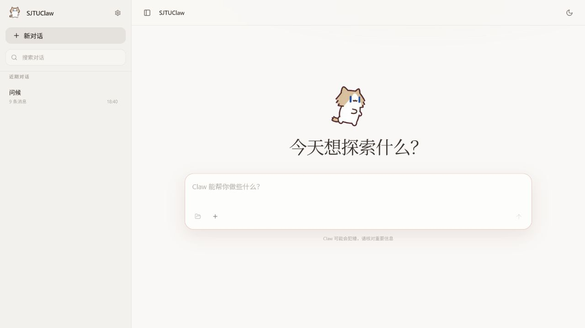

# SJTUClaw

面向个人与教学场景的本地 AI Agent Runtime。

SJTUClaw 把多轮对话、工具调用、长期记忆、Skill、定时任务和桌面宠物整合到同一套运行时中，并提供 Windows 桌面应用、Web UI、TUI、CLI、REST API 与 QQ Bot。



## 主要能力

- 三种按 Session 切换的 Agent 后端：SJTUClaw 原生 Agent、Pi、Claude Code。
- 18 个内置工具，覆盖文件、Shell、联网、记忆、Skill、Cron、附件和文件交付。
- Session 持久化、自动标题、分叉、上下文压缩、长期记忆与每日 Reflection。
- Workspace 路径边界、操作审批、AUTO / UNLIMITED 模式和可选 microsandbox microVM。
- Workspace 回退：同时恢复工作区文件和会话分支。
- Web UI 实时事件流、图片附件、生成文件下载、模型与 Agent 设置。
- Cron、Heartbeat、QQ Bot 和桌面宠物等后台能力。
- Windows 桌面打包与标准安装程序。

## 快速开始

### Windows 桌面版

运行发布的 SJTUClaw 安装程序。首次启动后，在“设置”中选择 Agent 后端并完成对应配置。

安装版数据默认保存在：

```text
%USERPROFILE%\.sjtuclaw\data
```

覆盖升级和卸载不会主动删除这里的用户数据。

### 源码运行

要求 Python 3.11+；只有开发 Web UI 时才需要 Node.js 18+。

```powershell
python -m venv .venv
.\.venv\Scripts\Activate.ps1
python -m pip install -r requirements.txt
python -m pip install -e .
sjtuclaw setup
```

也可以复制 `.env.example` 为 `.env` 后手动填写配置。

启动入口：

```text
sjtuclaw chat       CLI 对话
sjtuclaw tui        全屏终端界面
sjtuclaw gateway    Gateway、Web UI 和 REST API
sjtuclaw-desktop    本地 Gateway + 桌面窗口
```

Gateway 默认地址为 <http://127.0.0.1:8000>。

## Agent 后端

| 后端 | 适合场景 | 前置条件 |
| --- | --- | --- |
| `sjtuclaw` | 使用项目自带的 Agent Loop 和工具系统 | OpenAI Compatible API |
| `pi` | 使用 Pi 的模型、工具循环、Skills 和会话能力 | 本机可用的 Pi CLI |
| `claude` | 使用 Claude Code 的原生工具、Skills、MCP 和登录状态 | 本机已安装并登录 Claude Code |

在会话中切换：

```text
/pi on
/claude on
/pi off          # 切回原生后端
/claude off      # 切回原生后端
```

默认后端可以在 Web UI“设置 → Agent”或 `AGENT_BACKEND` 中配置。外部后端仍复用 SJTUClaw 的 Session、入口、审批桥接和宿主工具，但它们自己的原生执行环境不属于 microsandbox 隔离范围。

## Workspace、安全模式与 Sandbox

默认情况下，文件和 Shell 操作被限制在当前 Session 绑定的 Workspace 中，并按操作风险触发审批。

| 模式 | 审批行为 | 路径边界 | 是否持久化 |
| --- | --- | --- | --- |
| 默认 | 写入和 Shell 逐次审批 | Workspace 或 Sandbox `/workspace` | — |
| AUTO | 自动批准所有 `write` 级工具；实际运行在 microVM 内的 Shell 也自动批准 | 不变 | 随 Session 保存 |
| UNLIMITED | 写入、删除和 Shell 仍逐次审批 | 解除宿主 Workspace 边界 | 仅当前进程 |
| Sandbox | 原生文件、Shell、附件和下载工具路由到 Session 级 microVM | 私有卷或显式绑定目录 | 显式开关随 Session 保存 |

常用命令：

```text
/workspace set <目录>
/workspace show
/auto on
/unlimited on
/sandbox on
/sandbox status
```

设置 Workspace 后，每个用户回合开始前会创建检查点：

```text
/rollback
/rollback 2
/rollback list
/rollback undo
```

如需 microVM，安装可选依赖并准备镜像：

```powershell
python -m pip install -e ".[sandbox]"
.\packaging\sandbox\Build-SandboxImage.ps1
```

完整边界和故障策略见 [Sandbox 架构](docs/sandbox-architecture.md)。

## 常用会话命令

```text
/help                         查看完整命令
/session new|list|switch      管理会话
/memory add|list|search       管理长期记忆
/reflect status|now           管理每日反思
/compact                      压缩当前会话上下文
/skill list|show|usage        管理 Skill
/cron list|status             管理定时任务
/pet status|list|open|close   管理桌面宠物
/approvals                    查看待审批操作
/stop                         停止当前任务
```

## Web UI 与文件交付

Web UI 使用 SSE 展示思考、工具调用、审批和最终回复。单条用户消息最多上传 4 张图片，每张最多 20 MB；附件按 Session 隔离保存。

Agent 调用 `create_download` 后，Web UI 会显示图片预览或普通文件下载按钮。注册信息保存在 `data/downloads/registry.json`，最多保留 1000 条；源文件被删除后链接失效。

前端开发：

```powershell
cd webui
npm install
npm run dev
```

测试与生产构建：

```powershell
npx vitest run
npm run build
```

构建结果写入项目根目录的 `web/`，由 Gateway 和桌面版直接加载。

## 桌面宠物

内置月薪喵、线条小狗、蜡笔小新和黄油小熊。自定义宠物以 ZIP 导入，包内包含 `pet.json` 和一张 `spritesheet.webp` 或 `spritesheet.png`。

```json
{
  "id": "my-pet",
  "displayName": "我的宠物",
  "description": "角色性格与互动口吻。",
  "spriteVersionNumber": 2,
  "spritesheetPath": "spritesheet.webp"
}
```

- v1：8 × 9，固定 1536 × 1872。
- v2：8 × 11，固定 1536 × 2288，并增加 16 个观察方向。
- 新宠物建议使用 v2；导入时会校验路径、文件集合、压缩比、图片格式、透明通道、尺寸和动画格。

## 项目结构

```text
claw/                 Python 运行时
  agent/              Agent Loop、事件、预算和健康监控
  context/            上下文构建、预算和压缩
  tools/              内置工具与安全护栏
  session/            Session 模型与 JSONL 存储
  memory/             长期记忆与 Reflection
  scheduler/          Cron、Heartbeat 和任务分发
  workspace/          Workspace 边界与回退
  sandbox/            microsandbox 生命周期与路由
  gateway/            FastAPI、REST、SSE 和静态站点
  pi/                 Pi RPC 适配
  claude/             Claude Code 适配与审批桥接
  channels/           QQ Bot
  pet/                桌面宠物
webui/                React + TypeScript 前端
web/                  已构建前端
prompts/              运行时 Prompt 资源
skills/               内置 Skill
packaging/            Sandbox 与 Windows 打包
tests/                后端、前端和集成测试
docs/                 项目文档与 Code Wiki
```

## 开发与验证

```powershell
python -m pytest tests/ -v
cd webui
npx vitest run
npm run build
```

详细测试范围、真实 Sandbox 测试和格式检查见 [测试与开发](docs/testing.md)。

## 文档

- [配置说明](docs/configuration.md)
- [数据目录](docs/data-directory-guide.md)
- [Sandbox 架构](docs/sandbox-architecture.md)
- [测试与开发](docs/testing.md)
- [Windows 打包](docs/windows-packaging.md)
- [Sandbox 基础镜像](packaging/sandbox/README.md)
- [Code Wiki](docs/CODE_WIKI.md)：面向代码阅读者的详细架构、调用链、数据模型与模块说明

项目版本：`0.5.0`。
