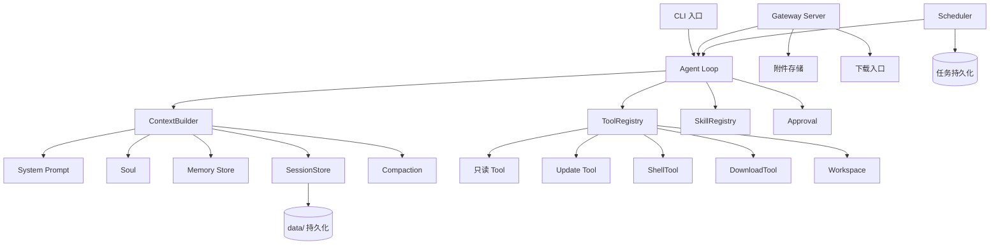

# SJTUClaw 开发计划

本文档基于 `SJTUClaw/SJTUClaw.md`（Step 0 ~ Step 9 + 评分标准）制定，用于指导按阶段推进开发、
验收和 AI Agent 协作开发。

## 一、总体架构设计



核心原则（贯穿所有阶段）：**CLI / Gateway / Scheduler / Skill 都只调用同一个
`run_agent_turn()` 入口，任何人都不能绕过 session store、context builder、tool registry
直接调 LLM 或直接改状态。**

## 二、推荐项目结构

```
SJTUClaw/
  .env.example
  .gitignore
  requirements.txt
  README.md
  docs/
    DEVELOPMENT_PLAN.md          # 本计划
    ARCHITECTURE.md              # 持续更新的架构说明
    QA_CHECKLIST.md              # 各阶段验收清单（收尾阶段汇总）
  prompts/
    system_prompt.md             # Step3
    soul.md                      # Step3
  data/                          # 全部为运行产物，.gitignore 排除内容
    sessions/<sessionId>/session.json
    sessions/<sessionId>/attachments/
    memory/memory.json
    tasks/tasks.json
    downloads/
  skills/
    course-report/SKILL.md
    material-summary/SKILL.md
    presentation-outline/SKILL.md
  web/                           # Step6 图形化入口（网页示例）
    index.html / app.js / style.css
  claw/                          # 主 Python 包
    __init__.py
    main.py                      # CLI 入口 (python -m claw.main)
    config.py                    # 读取 .env / 环境变量
    llm/
      client.py                  # 裸 LLM 调用封装
      protocol.py                # tool_call / tool_calls / final 协议解析（Step5起）
    session/
      models.py                  # Session、Message 数据结构
      store.py                   # SessionStore：增删改查+持久化
    context/
      builder.py                 # ContextBuilder：拼装 stable+conversation context
      compaction.py              # Step4 压缩逻辑
    memory/
      store.py                   # MemoryStore
    tools/
      base.py                    # Tool/ToolRegistry 抽象
      readonly.py                # current_time/list_dir/read_file
      update.py                  # create_file/overwrite_file/edit_file
      shell.py                   # new_shell/run_command
      download.py                # create_download
      attachment.py              # copy_attachment_to_workspace
    workspace/
      manager.py                 # workspace 路径解析与沙箱边界
    approval/
      manager.py                 # approval 请求/批准/拒绝
    agent/
      loop.py                    # run_agent_turn()：唯一 agent 入口
    skills/
      registry.py                # Step9 skill 扫描与加载
    gateway/
      server.py                  # HTTP/WS server
      routes/{chat,sessions,attachments,tasks,approvals,downloads,skills}.py
    scheduler/
      scheduler.py                # 后台轮询/触发
      tasks_store.py               # 任务持久化
    cli/
      repl.py                     # 交互循环
      commands.py                 # /session /memory /compact /skill 等内部命令
  tests/
    test_llm_client.py
    test_session_store.py
    test_context_builder.py
    test_compaction.py
    test_tools.py
    test_agent_loop.py
    test_gateway.py
    test_scheduler.py
    test_workspace_tools.py
    test_skills.py
```

**职责边界原则**：`session` 只管存取历史；`context` 只管拼装模型输入；`memory` 只管长期
事实；`tools` 只管定义+执行；`agent/loop.py` 是唯一编排者；`gateway`/`cli`/`scheduler`
都是"入口适配器"，不写业务逻辑。

> 现状说明：当前 `SJTUClaw/SJTUClaw/` 下已有 `config.py`、`llm_client.py`、`main.py`，
> 使用自定义 `sjtu_api_key` 文件读取密钥，不完全符合 Step 0.4 节要求（要求支持
> `.env`/环境变量 + 提供 `.env.example`）。阶段 1 会将其重构进 `claw/` 包并改为
> `.env` 配置方式。

## 三、阶段划分

| 阶段 | 对应 Step | 主题 | 复杂度 |
|---|---|---|---|
| 阶段 1 | Step 0 + Step 1 | 环境搭建 + 最小调用 + 多轮对话 Loop | 低 |
| 阶段 2 | Step 2 + Step 3 | 多 Session 持久化 + System Prompt/Soul/Memory | 中 |
| 阶段 3 | Step 4 | Compaction 上下文压缩 | 中 |
| 阶段 4 | Step 5 | Tool 系统 + Agent Loop 重构（关键架构里程碑） | 高 |
| 阶段 5 | Step 6 | Gateway + 图形化入口 | 高 |
| 阶段 6 | Step 7 | Scheduler 定时任务 | 中 |
| 阶段 7 | Step 8 | Workspace + Advanced Tool + Approval | 高 |
| 阶段 8 | Step 9 | Skill System | 中 |
| 阶段 9 | 收尾 | 联调、代码质量、文档、报告准备 | - |

划分依据：Step 0-5（基础功能 60 分）按耦合度合并为 4 个阶段；Step 6-9（高阶功能 20 分）
各自独立成阶段，因为每个都引入新的外部子系统（Gateway、Scheduler、Workspace、Skill）；
最后单列收尾阶段做整体质量把控。

---

## 阶段 1：环境准备 + 最小 LLM 调用 + 多轮对话 Loop（Step 0、1）

### 任务清单
1. 重构现有 `SJTUClaw/SJTUClaw/*.py` 为 `claw/` 包结构。
2. 用 `.env` + `.env.example`（`LLM_API_KEY`/`LLM_BASE_URL`/`LLM_MODEL`）替换现有
   `sjtu_api_key` 文件方案；`.gitignore` 加入 `.env`、`data/`。
3. `claw/config.py`：加载配置，缺失时给出清晰报错。
4. `claw/llm/client.py`：封装 `chat(messages) -> assistant_text`，处理网络异常、
   HTTP 异常、响应格式异常。
5. `claw/main.py` + `claw/cli/repl.py`：实现持续运行的 CLI 多轮对话循环，内存版
   session（list[dict]），支持 `/exit`。
6. README：写明启动命令、`.env` 配置说明。

### 验收标准
- [ ] 删除/不再提交任何真实 API Key；`git status` 确认 `.env` 未被跟踪。
- [ ] 缺少 `.env` 时运行程序，报错信息清晰指出缺什么配置，而不是抛出裸异常堆栈。
- [ ] 断网或 Base URL 错误时，报错清晰。
- [ ] `python -m claw.main` 能连续对话 ≥ 3 轮，assistant 能正确引用前面轮次的信息。
- [ ] `/exit` 能正常退出，Ctrl+C 不会导致崩溃报错栈糊满屏幕。
- [ ] CLI 输入输出逻辑与"调用 LLM 逻辑"分离在不同模块。

### AI Agent Prompt
```
你是 SJTUClaw 项目的开发者。请阅读项目根目录下 SJTUClaw/SJTUClaw.md 的 Step 0 和 Step 1 章节，
并在 SJTUClaw/ 项目中完成以下工作。

背景：项目目前在 SJTUClaw/SJTUClaw/ 下有一份简陋的 config.py、llm_client.py、main.py，
使用自定义 sjtu_api_key 文件读取密钥，不符合 Step 0.4 节要求（必须支持 .env / 环境变量，
并提供 .env.example）。请在保留可用逻辑的基础上重构。

任务：
1. 建立 claw/ Python 包，按以下子模块组织代码：
   claw/config.py, claw/llm/client.py, claw/main.py, claw/cli/repl.py
2. 配置加载：从 .env 或系统环境变量读取 LLM_API_KEY / LLM_BASE_URL / LLM_MODEL；
   缺失时抛出清晰的、面向用户的错误提示（不是原始异常堆栈）。
3. 提供 .env.example，并确保 .gitignore 包含 .env 和 data/。
4. 实现 LLM 客户端的最小调用能力：输入 messages 数组，返回 assistant 文本；
   捕获网络异常、HTTP 状态异常、响应体格式异常，分别给出清晰提示。
5. 实现 CLI 多轮对话 loop（claw/cli/repl.py）：
   - 启动时创建内存 session（本阶段允许程序退出后历史丢失）
   - 每轮把当前 session 全部历史 + 本轮用户输入一起发给模型
   - assistant 回复要追加进 session 历史
   - 支持 /exit 退出，支持 Ctrl+C 优雅退出
   - CLI 输入输出逻辑与 LLM 调用逻辑必须拆分到不同模块，不能耦合在一个函数里
6. 更新 README.md：写明如何配置 .env、如何启动（固定命令 python -m claw.main）。

约束：
- 不能把 API Key 写死在代码里，也不能出现在任何提交内容中。
- 尽量遵循 PEP8，模块职责单一。

完成后请自检：
- 删除 .env 后运行程序，确认报错信息清晰
- 正常配置下运行，进行至少 3 轮对话，验证 assistant 能记住前文
- 检查 git diff 中不包含任何密钥
把自检过程和结果写在回复中。
```

---

## 阶段 2：多 Session 持久化 + System Prompt / Soul / Memory（Step 2、3）

### 任务清单
1. `claw/session/models.py`：定义 `Session`（sessionId, title, messages, createdAt,
   updatedAt）、`Message`。
2. `claw/session/store.py`：`create/list/get/switch/rename/delete/save/load`，落盘到
   `data/sessions/<sessionId>/session.json`；保存失败、JSON 损坏时不能静默丢数据。
3. CLI 命令：`/session new|list|switch|rename|delete`，由 `claw/cli/commands.py` 拦截。
4. `claw/context/builder.py`：雏形版——组装 `system prompt + 当前 session 历史`。
5. `prompts/system_prompt.md`、`prompts/soul.md`：独立文件加载，重启后生效，不能被
   普通对话覆盖。
6. `claw/memory/store.py`：`add/list/delete`，持久化到 `data/memory/memory.json`。
7. CLI 命令：`/memory add|list|delete`。
8. 扩展 `ContextBuilder`：`system prompt + soul + memory + session_history` 统一组装。

### 验收标准
- [ ] 重启程序后，之前创建的 session 全部还在，历史消息不丢失。
- [ ] `/session list` 展示 sessionId/title/消息数/更新时间。
- [ ] 切换 session 后新请求只用该 session 历史。
- [ ] 手工损坏一个 `session.json`，程序能给出明确错误而不是静默清空。
- [ ] 修改 `prompts/soul.md` 后重启程序，回复风格随之变化；普通用户消息不能改变
      soul/system prompt。
- [ ] `/memory add` 后新建一个 session 提问，assistant 能利用 memory 内容回答。
- [ ] `/memory delete` 后该条记忆不再出现在上下文中。
- [ ] session/memory 命令均不作为普通消息发给 LLM。

### AI Agent Prompt
```
你是 SJTUClaw 项目的开发者，当前项目已完成 Step 0/1（阶段 1）：claw/ 包下有基础配置、
LLM 客户端和内存版多轮对话 CLI。请阅读 SJTUClaw/SJTUClaw.md 的 Step 2 和 Step 3 章节，
在此基础上实现多 Session 持久化与 System Prompt / Soul / Memory。

任务：
1. 在 claw/session/ 下实现 models.py（Session, Message 数据结构：sessionId, title,
   messages, createdAt, updatedAt）和 store.py（SessionStore），支持创建、列出、切换、
   重命名、删除、保存到 data/sessions/<sessionId>/session.json、程序重启后加载。
   要求：保存失败要有清晰报错；JSON 损坏/解析失败不能静默丢数据。
2. 在 claw/cli/commands.py 中实现内部命令解析：
   /session new, /session list, /session switch <id>, /session rename <id> <title>,
   /session delete <id>。这些命令必须被 CLI 直接拦截处理，不能作为普通消息发给 LLM。
3. 在 claw/context/builder.py 中实现 ContextBuilder，职责是把「存储结构」转换成「模型
   输入结构」：目前只需要拼装 system prompt + 当前 session 历史，返回发给 LLM 的
   messages 数组。CLI 和 LLM 调用逻辑都必须通过它获取上下文，不能自己临时拼。
4. 新增 prompts/system_prompt.md 和 prompts/soul.md，程序启动时从这两个独立文件加载，
   不允许硬编码在代码里；也不允许被普通用户消息覆盖或改写。
5. 在 claw/memory/ 下实现 MemoryStore：add/list/delete，持久化到
   data/memory/memory.json，memory 是跨 session 的长期信息。
6. CLI 命令新增：/memory add <content>, /memory list, /memory delete <id>，同样不能
   作为普通消息发给 LLM。
7. 扩展 ContextBuilder，使其按顺序组装：system prompt -> soul -> memory -> 当前
   session 历史，返回最终 messages。
8. 更新 README，说明新增命令用法和数据存放位置。

约束：
- 严格区分 stable context（system prompt/soul/memory）与 conversation context
  （session 历史）：前者只能通过专门命令或配置文件修改，绝不能被普通对话自动改写。
- session 存储必须能用 sessionId 稳定定位，不能靠人工翻找一个大文件。

完成后请自检并在回复中体现：
- 重启程序验证 session 历史不丢失
- 制造一个损坏的 session.json，验证不会静默丢数据
- 用 /memory add 写入一条记忆，切到新 session 验证 memory 跨 session 生效
- 确认 soul 修改后影响回复风格，但不会被用户消息覆盖
```

---

## 阶段 3：Compaction 上下文压缩（Step 4）

### 任务清单
1. `Session` 增加 `summary` 字段。
2. `claw/context/compaction.py`：触发判断（字符数/消息数阈值均可）、调用 LLM 生成
   摘要、合并旧 summary、只保留最近 N 轮原始消息。
3. `ContextBuilder` 更新组装顺序：`system prompt -> soul -> memory -> session summary
   -> recent session messages`。
4. Agent 主循环中每轮对话后检查是否需要 compaction；失败时保留原始消息不丢失。
5. CLI 命令 `/compact` 手动触发，打印压缩前后对比和 summary 内容。

### 验收标准
- [ ] 构造足够长的对话，验证达到阈值后自动触发压缩，打印
      `old_messages=n, recent_messages=m` 和 summary 预览。
- [ ] 压缩后再问"我们之前做了什么/当前任务是什么"，assistant 能基于 summary 正确回答。
- [ ] 人为让 compaction 的 LLM 调用失败，验证旧消息不会被删除。
- [ ] summary 为空/无效时不应用本次结果（原消息保留）。
- [ ] `/compact` 手动命令可用，且不作为普通消息发给 LLM。
- [ ] system prompt / soul / memory 不参与压缩。

### AI Agent Prompt
```
你是 SJTUClaw 项目的开发者，当前项目已完成 Step 0-3（阶段 1、2）：多 session 持久化、
system prompt / soul / memory 分层上下文均已实现。请阅读 SJTUClaw/SJTUClaw.md 的
Step 4 章节，实现 Compaction。

任务：
1. 扩展 Session 数据结构，增加 summary 字段（字符串，随 session 持久化）。
2. 在 claw/context/compaction.py 中实现：
   - 触发判断函数：基于消息数量或字符总长度的阈值（在代码注释和 README 中写清楚具体
     阈值和理由）判断当前 session 是否需要压缩。
   - 压缩函数：调用 LLM 把「较早消息」压缩成摘要，摘要需保留当前任务、已完成内容、
     用户明确要求/偏好/约束、未解决问题、影响后续回答的关键事实；去掉寒暄、重复、
     无关细节。新 summary 需要合并已有 summary 和本次被压缩的旧消息，而不是覆盖式
     丢弃旧 summary。
   - 只保留最近若干轮原始消息不压缩。
3. 严格遵守边界：system prompt、soul、memory 配置/数据完全不参与 compaction 的读取
   或改写。
4. 更新 claw/context/builder.py 的组装顺序为：
   system prompt -> soul -> memory -> session summary -> recent session messages。
5. 在 agent 对话主循环中，每轮对话结束后检查是否需要 compaction 并执行；
   失败保护：
   - LLM 调用失败时不追加空 assistant 消息
   - compaction 调用失败时不删除旧消息
   - summary 为空或无效时不应用本次压缩结果
   - compaction 成功后打印压缩结果和 summary 预览
   - 保存失败时提示用户
6. 新增 CLI 命令 /compact，手动立即触发当前 session 压缩，并打印
   old_messages/recent_messages/summary 内容（参考文档 4.9 节示例格式）。

完成后请自检并在回复中体现：
- 用脚本或手动多轮对话把某个 session 撑到超过阈值，验证自动压缩触发且旧消息不丢
- 人为制造一次 LLM 调用失败（比如传错模型名）来触发 compaction，验证旧消息未被删除
- 验证压缩后 assistant 仍能正确回答"当前任务/已完成内容"类问题
- 验证 /compact 手动命令效果和输出格式
```

---

## 阶段 4：Tool 系统 + Agent Loop 重构（Step 5，关键里程碑）

### 任务清单
1. `claw/tools/base.py`：`Tool`（name/description/input_schema/handler/safety_level）、
   `ToolRegistry`（注册/查找/列出 definitions/执行并校验参数）。
2. `claw/tools/readonly.py`：`current_time`、`list_dir`、`read_file`，safety_level
   全部为 `read_only`；文件不存在/过大要有清晰处理。
3. `claw/llm/protocol.py`：定义并解析 `tool_call` / `tool_calls`（最多 5 个）/
   `final` 协议；若模型支持原生 function calling，可直接对接原生协议，否则解析
   结构化 JSON（容忍 JSON 前后夹杂文本）。
4. `claw/agent/loop.py`：实现 `run_agent_turn(session_id, user_message)`，作为唯一入口：
   `buildContext -> callLLM -> 若 final 则结束 -> 若 tool_call(s) 则执行并把结果写入
   session -> 重新 buildContext -> 再次 callLLM -> 循环直到 final`。
5. Tool 结果作为 `tool` 角色消息进入 session 历史，可被 compaction 压缩；tool 失败
   要作为 observation 反馈而不是崩溃。
6. `ContextBuilder` 增加 tool 使用说明/tools 参数注入。
7. 记录 tool 调用 trace。
8. 把阶段 1 中 CLI 直接调用 LLM 的逻辑，改为统一调用 `run_agent_loop`。

### 验收标准
- [ ] "当前时间是多少？" 能正确触发 `current_time` 并回答真实时间。
- [ ] "列出当前项目目录" 能触发 `list_dir` 并基于真实目录结构回答。
- [ ] "读取 README.md 并总结" 能触发 `read_file` 并基于真实内容总结。
- [ ] "讲解这个仓库"能看到多次 tool call。
- [ ] 请求不存在的 tool 或参数非法时，runtime 返回清晰错误而不是崩溃。
- [ ] 读取不存在文件时返回明确错误；超大文件被截断或报错。
- [ ] 单轮最多 5 个 tool call 的限制生效。
- [ ] tool result 消息能被后续 compaction 压缩。
- [ ] CLI、session、memory、compaction 等已有功能全部保持可用（回归测试）。

### AI Agent Prompt
```
你是 SJTUClaw 项目的开发者，当前项目已完成 Step 0-4：session 持久化、system prompt/
soul/memory、compaction 均已实现，核心对话通过 ContextBuilder 组装。请阅读
SJTUClaw/SJTUClaw.md 的 Step 5 章节，实现只读 Tool 与 Agent Loop 改造。这是本项目
最关键的架构里程碑：之后 Step 6-9 都会在这个 Agent Loop 上继续扩展，请确保接口设计
足够通用（预留 tool safety_level、approval 挂钩点，但本阶段不要实现写操作 tool）。

任务：
1. claw/tools/base.py：定义 Tool 数据结构（name, description, input_schema, handler,
   safety_level）和 ToolRegistry（register/list_definitions/execute_by_name，
   execute 时要校验参数是否符合 schema，而不是直接信任模型输出，返回统一格式的
   result 或 error）。
2. claw/tools/readonly.py：实现三个只读 tool：
   - current_time：返回当前时间
   - list_dir：列出指定目录内容
   - read_file：读取文本文件内容，文件不存在要返回明确错误，文件过大要截断或报错
   三个 tool 的 safety_level 必须是 read_only。
3. claw/llm/protocol.py：定义模型输出协议，支持三种结果：
   - {"type": "tool_call", "tool": ..., "args": {...}}
   - {"type": "tool_calls", "calls": [最多 5 个]}
   - {"type": "final", "content": "..."}
   如果所用模型 API 原生支持 function calling，优先直接使用原生协议；否则要求模型输出
   结构化 JSON，并实现「即使 JSON 前后夹杂解释文字也能提取出合法 JSON」的解析逻辑。
   不允许用简单字符串匹配代替协议解析。
4. claw/agent/loop.py：实现 run_agent_turn(session_id, user_message) 作为整个项目
   唯一的 agent 入口：
   buildContext -> callLLM -> 如果是 final 则把 assistant 消息写入 session 并结束
   -> 如果是 tool_call(s)，执行对应 handler（未知 tool 名/参数错误要返回清晰 error），
   把每个 tool 的执行结果作为 tool 消息写入 session -> 重新 buildContext -> 再次
   callLLM -> 循环直到拿到 final。不设置总迭代轮数上限，但单轮最多处理 5 个
   tool call。
5. 把 ContextBuilder 扩展为在上下文中加入「可用 tool 列表」及协议说明（如果走原生
   function calling，则通过 API 的 tools 参数传入而不是拼进 system message）。
6. tool 调用需要打印 trace，例如 [tool_call] list_dir {"path": "."}，方便调试和验收。
7. 把 claw/cli/repl.py 中原本直接调用 LLM 的逻辑，改为统一调用
   claw/agent/loop.py 的 run_agent_turn，确保 CLI 不再绕过这条路径。

约束：
- 模型只能"请求"调用 tool，真正执行必须在 runtime（ToolRegistry.execute）完成。
- tool 失败要作为 observation 反馈给模型，不能让程序崩溃，也不能假装成功。
- 本阶段严禁实现任何写文件、删文件、执行命令类 tool（那是 Step 8 的内容）。

完成后请自检并在回复中体现：
- "当前时间是多少？" "列出当前项目目录" "读取 README.md 并总结" "讲解这个仓库"
  四个场景的真实运行结果（贴出关键输出）
- 故意请求一个不存在的 tool 或传错参数，确认 runtime 给出清晰错误且模型能继续回答
- 确认此前的 session/memory/compaction 功能仍然正常（跑一遍已有回归场景）
```

---

## 阶段 5：Gateway + 图形化入口（Step 6）

### 任务清单
1. `claw/gateway/server.py`：HTTP server（推荐 FastAPI/Flask），提供聊天、session
   列表/创建/切换、附件上传等路由；单次请求异常不能使进程退出。
2. Gateway 内部只调用 `run_agent_turn`，不得直接调 LLM client。
3. `web/`：最小网页前端，能发消息、展示历史、列出/创建/切换 session、展示错误；
   不持有/展示 API Key。
4. 附件：`data/sessions/<sessionId>/attachments/`，上传接口按 session 隔离。
5. Session 路由策略明确并写入文档。

### 验收标准
- [ ] Gateway 能独立启动，持续接收请求，单次报错不导致进程崩溃。
- [ ] 网页端发消息 -> 收到 assistant 回复，该轮消息也出现在 CLI 查看的同一 session
      历史里。
- [ ] 网页端能列出、创建、切换 session，切换后历史正确刷新。
- [ ] 上传附件后，仅当前 session 能看到该附件 metadata。
- [ ] 前端代码和网络请求不包含/不返回 LLM API Key。
- [ ] Gateway 触发的对话仍然会触发 compaction/memory/tool。

### AI Agent Prompt
```
你是 SJTUClaw 项目的开发者，当前项目已完成 Step 0-5：claw/agent/loop.py 中的
run_agent_turn(session_id, user_message) 是唯一的 agent 入口，内部整合了
session/context/memory/compaction/tool registry。请阅读 SJTUClaw/SJTUClaw.md 的
Step 6 章节，实现 Gateway 与一个图形化入口（网页）。

任务：
1. 在 claw/gateway/server.py 中实现一个可独立启动、长期运行的 HTTP server（可用
   FastAPI 或 Flask），至少提供以下路由：
   - POST /chat：接收 {sessionId?, message}，调用 run_agent_turn，返回 assistant
     回复、session 信息或错误信息；sessionId 缺失或不存在时的处理策略要清晰（返回
     错误或自动创建新 session，二选一并在响应/文档中写明）
   - GET /sessions：列出已有 session
   - POST /sessions：创建新 session
   - GET /sessions/{id}/messages：获取该 session 历史
   - POST /sessions/{id}/attachments：上传附件
   - GET /sessions/{id}/attachments：列出该 session 的附件 metadata（文件名、大小、
     类型、上传时间）
   要求：Gateway 只能调用 run_agent_turn，不允许直接 import/调用 LLM client；
   单次请求处理异常必须被捕获并返回错误响应，不能导致 server 进程退出。
2. 附件存储路径为 data/sessions/<sessionId>/attachments/，必须与 session 严格
   隔离：一个 session 的附件 metadata 不能通过接口被另一个 session 查到。
3. 在 web/ 目录实现一个最小网页前端（原生 HTML/JS 或轻量框架均可），要求：
   - 输入框发送消息，展示 assistant 回复和历史消息
   - 展示 session 列表，支持创建新 session、切换 session（切换后拉取并展示对应历史）
   - 展示 Gateway 返回的错误信息
   - 支持上传附件
   - 前端代码和网络请求中不能出现、不能保存 LLM API Key
4. 确保 CLI 和 Gateway 产生的 user/assistant/tool 消息进入同一份 session 数据
   （用 CLI 建的 session 应该能在网页端看到，反之亦然）。

完成后请自检并在回复中体现：
- 启动 Gateway，用网页发一条消息，再切到 CLI 用同一个 sessionId 查看历史，确认一致
- 制造一次异常请求（如给不存在的 sessionId 发消息），确认 Gateway 不崩溃且返回清晰
  错误
- 上传附件到 session A，确认 session B 看不到该附件
- 检查浏览器网络请求/前端源码，确认没有 API Key 泄露
- 触发一次会用到 tool 的对话，确认网页端也能正常展示 tool 调用后的最终回复
```

---

## 阶段 6：Scheduler 定时任务（Step 7）

### 任务清单
1. `claw/scheduler/tasks_store.py`：任务数据结构（内容、触发计划、下次触发时间、
   状态、所属 session、执行历史），持久化到 `data/tasks/tasks.json`。
2. `claw/scheduler/scheduler.py`：后台轮询到期任务；支持一次性任务和周期性任务；
   到期后调用 `run_agent_turn`；执行完成后更新状态、写执行历史。
3. 边界策略需在代码注释/README写清楚。
4. Gateway 路由：创建/列出/查看/取消任务。
5. 网页端：任务表单、列表、状态、执行历史、取消按钮。

### 验收标准
- [ ] 一次性任务到期后，assistant 回复正确写入对应 session。
- [ ] 周期性任务能连续触发 ≥ 2 次，执行历史都保留。
- [ ] 重启后任务数据不丢失。
- [ ] 取消任务后不再触发。
- [ ] 非法输入时创建任务失败并报错。
- [ ] 任务执行异常会被记录为失败，不会让 Scheduler 崩溃或吞掉错误。
- [ ] 网页端能完成任务创建、查看、取消全流程。

### AI Agent Prompt
```
你是 SJTUClaw 项目的开发者，当前项目已完成 Step 0-6：Gateway 和网页前端已就绪，
唯一 agent 入口是 claw/agent/loop.py 的 run_agent_turn(session_id, user_message)。
请阅读 SJTUClaw/SJTUClaw.md 的 Step 7 章节，实现 Scheduler 与定时任务。

任务：
1. claw/scheduler/tasks_store.py：定义任务数据结构，至少包含：任务内容、触发计划
   （一次性时间点 or 周期规则）、下一次触发时间、状态（等待中/执行中/已完成/已取消/
   失败）、所属 sessionId、执行历史（每次执行的 assistant 回复/错误/时间）。持久化到
   data/tasks/tasks.json，需要支持增删改查。
2. claw/scheduler/scheduler.py：实现后台轮询逻辑（可用线程/asyncio 均可），
   周期性检查任务是否到期：
   - 支持一次性任务：到期执行一次，完成后不再重复
   - 支持周期性任务：固定间隔或每天固定时间即可，不要求完整 cron 表达式，
     但必须真的能重复触发
   - 到期后：标记执行中 -> 把任务内容作为 user message 交给 run_agent_turn
     -> 保存 assistant 回复或错误到执行历史 -> 更新状态 -> 若是周期性任务计算
     下一次触发时间
   - 需要在代码注释和 README 中明确写出以下边界策略：单次执行失败后是否继续下一次
     触发；执行时间超过间隔时如何处理；取消任务是否终止所有未来触发；程序关闭期间
     错过的触发是否补执行
   - 程序重启后必须能恢复未完成任务继续调度
3. 在 claw/gateway/server.py 增加任务管理路由：创建任务（校验时间/规则/session 是否
   合法，非法则报错不创建）、列出任务（展示内容/类型/规则/下次触发时间/状态/所属
   session/创建更新时间）、查看单个任务执行历史、取消任务。
4. 在 web/ 前端增加：创建一次性任务表单、创建周期性任务表单、任务列表、任务状态、
   执行历史展示、取消按钮，并展示任务所属 session。
5. Scheduler 必须复用 run_agent_turn，不能绕过 context builder / tool registry /
   memory / compaction，也不能自己拼一套聊天历史。

完成后请自检并在回复中体现：
- 创建一个 1-2 分钟后触发的一次性任务，等待验证其结果正确写入对应 session
  （可在 CLI 或网页查看该 session 历史）
- 创建一个短周期的周期性任务，验证连续触发多次且执行历史都被保留
- 重启程序，验证任务数据、状态、下次触发时间未丢失
- 取消一个任务，验证其不再触发
- 构造一次会失败的任务执行（例如任务内容触发一个会出错的 tool 调用），验证失败被
  记录而不是让 Scheduler 崩溃或静默忽略
```

---

## 阶段 7：Workspace + Advanced Tool + Approval（Step 8）

范围较大，包含 3 个子系统，建议按 "Workspace 边界 -> Update/Shell/Download Tool ->
Approval 流程接入" 顺序推进，各自单元测试。

### 任务清单
1. `claw/workspace/manager.py`：设置/查看当前 workspace；路径解析禁止 `../`、绝对
   路径逃逸；未设置 workspace 时相关写操作直接拒绝。
2. `claw/tools/update.py`：`create_file` / `overwrite_file` / `edit_file`，路径越界
   直接失败。
3. `claw/tools/shell.py`：`new_shell`（重启旧 shell）、`run_command`（复用同一
   shell），执行前后校验 cwd 仍在 workspace 内。
4. `claw/tools/download.py`：`create_download`，向 Gateway 注册临时下载入口。
5. `claw/tools/attachment.py`：`copy_attachment_to_workspace`，只能访问当前 session
   附件。
6. `claw/approval/manager.py`：approval 请求、批准/拒绝、结果写回 session；update/
   shell tool 执行前必须先创建 approval；download tool 不需要走这个流程。
7. Gateway 路由 + 网页端：设置/查看 workspace、审批列表/批准/拒绝、展示下载链接。
8. Agent loop 接入 approval 挂钩。

### 验收标准
- [ ] 未设置 workspace 时写操作被明确拒绝。
- [ ] 设置 workspace 后，创建/修改文件走 approval，批准后真实生效。
- [ ] 拒绝 approval 后文件未变化，session 中能看到拒绝原因。
- [ ] `../`/绝对路径写 workspace 外文件被拒绝。
- [ ] `new_shell` + 连续 `run_command` 验证 cwd 状态保留。
- [ ] shell 离开 workspace 被检测并终止。
- [ ] `create_download` 生成的链接可下载到正确内容，且不需要 approval。
- [ ] `copy_attachment_to_workspace` 跨 session 访问被拒绝。
- [ ] CLI 和网页端都能设置 workspace、审批 approval。
- [ ] 只读 tool、memory、compaction 等回归正常。

### AI Agent Prompt
```
你是 SJTUClaw 项目的开发者，当前项目已完成 Step 0-7：run_agent_turn 是唯一 agent
入口，Gateway/网页/Scheduler 均已接入。请阅读 SJTUClaw/SJTUClaw.md 的 Step 8 章节，
实现 Workspace、Advanced Tool（Update/Shell/Download）与 Approval 流程。这一阶段
范围较大，请按 Workspace -> Update/Shell/Download Tool -> Approval 的顺序推进，
每完成一块先自测再进入下一块。

任务：
1. claw/workspace/manager.py：
   - 支持设置/查看当前 workspace（可以按 session 绑定，也可以是 runtime 全局配置，
     自行决定并在代码注释中说明）
   - 提供路径解析函数：把 tool 传入的相对路径解析到 workspace 内，禁止通过 ../ 或
     绝对路径逃逸出 workspace，非法路径直接拒绝并返回清晰错误
   - 如果 workspace 未设置，任何涉及文件修改/命令执行/附件拷贝/下载入口创建的
     tool 调用都必须直接失败并提示先设置 workspace
2. claw/tools/update.py：实现 create_file / overwrite_file / edit_file（三选一
   合并成 update_file + operation 参数也可以，但必须覆盖创建/覆盖/编辑三种能力）。
   每次执行结果需要包含：是否成功、tool 名称、影响路径、简要结果或错误信息。
   路径若超出 workspace，直接返回失败，不允许写入。
3. claw/tools/shell.py：实现两个 tool：
   - new_shell：启动新 shell，若已有旧 shell 则先终止旧的；新 shell 初始 cwd 必须是
     workspace 或其子目录
   - run_command：在当前 shell 中运行命令，必须复用同一个 shell 进程（后续命令要能
     继承前面 cd/环境变量/source 的效果）；没有已启动的 shell 时返回明确错误提示
     先调用 new_shell。执行前后都要检查 shell 当前 cwd 是否仍在 workspace 内，
     如果越界要终止该 shell 并返回错误。返回结果需包含：是否成功、执行的命令、
     执行时 cwd、退出码、stdout、stderr、是否超时、输出是否被截断、错误信息
4. claw/tools/download.py：实现 create_download，为 workspace 内已存在文件生成
   一个临时下载入口（downloadId 或 downloadUrl），并让 Gateway 能提供实际文件下载
   路由。create_download 本身不需要把文件内容返回给模型。
5. claw/tools/attachment.py：实现 copy_attachment_to_workspace，只能访问「当前
   session」通过 Gateway 上传绑定的附件（Step 6 已实现的附件系统），把附件拷贝到
   workspace 内指定路径；目标路径必须按 workspace 解析且不能逃逸；不能访问其他
   session 的附件。
6. claw/approval/manager.py：实现 Approval 请求/批准/拒绝：
   - approvalId、tool 名称、本次调用参数
   - update tool 和 shell tool 在真正执行前，agent loop 必须先创建 approval 并
     暂停执行，等待用户批准或拒绝
   - 批准：执行对应 tool，把 tool result 写入 session 历史
   - 拒绝：不执行 tool，允许用户附带拒绝原因，把拒绝结果作为 observation 写入
     session 历史，供模型继续回答
   - download tool 不需要经过这个 approval 流程
7. 把以上 tool 全部注册进已有的 claw/tools/base.py 的 ToolRegistry，并在
   claw/agent/loop.py 中接入 approval 挂钩：模型请求 update/shell 类 tool 时先走
   approval，创建下载入口则直接执行。
8. 在 Gateway 和网页前端中新增：设置/查看 workspace、待审批列表、批准/拒绝操作、
   下载链接展示。CLI 也需要支持设置 workspace 和审批，但不需要做下载按钮（按文档
   要求，CLI 不需要实现下载展示）。

完成后请自检并在回复中体现：
- 未设置 workspace 时尝试改文件，确认被明确拒绝
- 设置 workspace 后走一次完整流程：模型请求创建文件 -> approval 批准 -> 文件真实
  生成 -> session 历史里能看到 tool result
- 走一次 approval 拒绝流程，确认文件未变化且模型基于拒绝原因继续回答
- 尝试用 ../ 或绝对路径写 workspace 外文件，确认被拒绝
- new_shell 后连续两次 run_command 验证 cwd/环境状态被保留；再故意 cd 到
  workspace 外验证 shell 被终止
- create_download 生成下载链接并验证可下载到正确文件内容
- 用另一个 session 尝试 copy_attachment_to_workspace 读取第一个 session 的附件，
  确认被拒绝
- 回归验证只读 tool、memory、compaction 仍然正常
```

---

## 阶段 8：Skill System（Step 9）

### 任务清单
1. `claw/skills/registry.py`：扫描 `skills/` 目录，解析每个 `SKILL.md` 的
   frontmatter（name/description/instructions），生成轻量索引；按名称加载完整
   内容+资源。
2. `skills/course-report/SKILL.md`（必做）+ 另外 2 个。
3. CLI：`/skill list`、`/skill show <name>`、`/skill <name> <task>`、`/skill usage`。
4. Agent loop 接入：显式调用直接加载 skill 内容；普通消息场景下把轻量索引放进
   上下文，让模型自主判断是否需要 skill，选中前必须先给用户发提示/approval。
5. Skill 使用记录写入 session。
6. Skill 触发的文件生成必须走已有 update tool + approval 流程。
7. 网页端：skill 列表/描述展示、选择 skill 输入任务、展示是否使用 skill 及原因。

### 验收标准
- [ ] `/skill list` 展示至少 3 个 skill 及描述。
- [ ] `/skill course-report <任务>` 能生成结构化 Markdown 草稿并通过 approval
      写入 workspace。
- [ ] 不加 `/skill` 前缀，模型能自主选择 course-report，且用户会先看到使用提示。
- [ ] `/skill usage` 能看到本 session 的使用记录。
- [ ] 未被选中的 skill 完整内容不会塞进每次上下文。
- [ ] Skill 场景仍遵守 workspace 边界和 approval 流程。
- [ ] 网页端能选择 skill、填任务并查看是否使用了 skill 及原因。

### AI Agent Prompt
```
你是 SJTUClaw 项目的开发者，当前项目已完成 Step 0-8：workspace、update/shell/
download tool 与 approval 流程均已就绪，run_agent_turn 是唯一 agent 入口。请阅读
SJTUClaw/SJTUClaw.md 的 Step 9 章节，实现 Skill System。

任务：
1. claw/skills/registry.py：
   - 扫描 skills/ 目录下每个子目录，解析其中 SKILL.md 的 frontmatter（name,
     description）和正文 instructions
   - 提供「轻量索引」接口：仅返回 name + description 列表，用于日常放入上下文
   - 提供「按名称加载完整内容」接口：返回 instructions 全文及相关 assets/
     references 资源路径，只有 skill 被选中时才调用
2. 在 skills/ 目录下实现至少 3 个 skill，其中必须包含 course-report：
   - skills/course-report/SKILL.md：面向课程报告/小论文/学习总结/实验报告场景，
     说明如何根据用户提供的课程要求、主题、字数、参考材料、保存路径，生成结构化
     Markdown 草稿
   - 另外至少 2 个自选（可参考文档建议的 material-summary、presentation-outline），
     每个都要有清晰 description，说明能做什么、什么情况应该用它
3. CLI 命令（claw/cli/commands.py）：
   - /skill list：列出所有 skill 名称和描述
   - /skill show <name>：查看某个 skill 详情
   - /skill <name> <task>：显式调用，runtime 直接加载该 skill 完整内容，连同用户
     任务一起交给 run_agent_turn
   - /skill usage：查看当前 session 的 skill 使用记录
   这些命令不能作为普通消息发给 LLM。
4. Agent loop 接入（claw/agent/loop.py + context/builder.py）：
   - 普通消息进入 agent loop 前，context builder 把 skill 轻量索引加入上下文，
     供模型判断是否需要用某个 skill
   - 模型可以通过明确的结构化表达（例如复用/扩展现有 tool_call 协议，比如一个
     use_skill 内部动作）表达"我要使用某个 skill"
   - 模型自主选择使用 skill 之前，必须先给用户一个提示/approval，明确告知选用了
     哪个 skill 及原因，用户确认后才真正加载完整 skill 内容继续执行
   - Skill 内容加载后，仍需复用已有 session store / context builder / memory /
     tool registry / workspace / approval / compaction，不能绕过
   - Skill 若需要生成文件，必须通过已有 update tool 发起写入，并走 approval 流程
5. Skill 使用记录需要写入 session，至少包含：使用的 skill 名、所属 session、用户
   任务、调用来源（explicit/auto）、auto 时模型的选择理由、使用时间、最终输出或
   保存路径。/skill usage 从这里读取展示。
6. 在网页前端增加：skill 列表和描述展示、选择 skill 并输入任务的入口、展示本轮是否
   使用了 skill 及原因，并复用已有 approval UI 完成报告草稿保存的确认。

完成后请自检并在回复中体现：
- /skill list 输出，确认至少 3 个 skill 且描述清晰
- 用 /skill course-report 显式调用，附带一个具体课程报告任务（主题、字数、参考
  材料、保存路径），验证 approval 批准后文件真实写入 workspace 对应路径，内容是
  结构化 Markdown
- 不加 /skill 前缀，直接输入一个明显适合 course-report 的任务，验证模型能自主
  选择该 skill，且用户会先看到使用提示/approval
- /skill usage 输出，确认记录了本 session 内两次 skill 使用（explicit 和 auto
  各一次）
- 确认未被选中的 skill 完整内容不会出现在普通请求的上下文里（只有索引）
```

---

## 阶段 9（收尾）：整体联调、代码质量与报告准备

### 任务清单
1. 端到端回归：写一份 `docs/QA_CHECKLIST.md` 汇总所有阶段验收项，逐条勾选。
2. 补齐单元测试（`tests/`）。
3. 代码质量：统一命名风格、清理调试代码、补充 docstring、跑静态检查。
4. 文档完善：README、`docs/ARCHITECTURE.md`、中期/结题报告素材。
5. 安全自查：确认密钥/附件产物不在 Git 历史中。

### 验收标准
- [ ] `docs/QA_CHECKLIST.md` 中阶段 1-8 全部验收项打勾。
- [ ] `pytest` 全部通过。
- [ ] 静态检查无严重告警。
- [ ] README 能让新同学从零跑起完整系统。
- [ ] 确认 Git 历史中不存在任何真实密钥。

### AI Agent Prompt
```
你是 SJTUClaw 项目的开发者，Step 0-9 的功能均已实现（session/context/memory/
compaction/tool/agent loop/gateway/scheduler/workspace/approval/skill）。请阅读
SJTUClaw/SJTUClaw.md 全文和项目现状，完成收尾工作。

任务：
1. 整理 docs/QA_CHECKLIST.md，把 Step 0-9 每一步文档中"最小程序行为"对应的验收
   场景都列出来，逐条实际跑一遍并记录结果（通过/不通过/备注）。
2. 补齐 tests/ 下的自动化测试，覆盖：SessionStore 增删改查与持久化、ContextBuilder
   组装顺序、Compaction 的触发/失败保护逻辑、ToolRegistry 参数校验与未知 tool 报错、
   Workspace 路径逃逸防护（../、绝对路径）、Approval 批准/拒绝两条分支。跑
   pytest 确认全部通过。
3. 做一次代码质量清理：统一命名、去除调试用的临时打印/注释代码、给关键模块
   （agent/loop.py、context/builder.py、tools/base.py、workspace/manager.py、
   approval/manager.py）补充清晰 docstring；跑一次静态检查工具（如 ruff 或
   flake8）并修复可以修复的告警。
4. 完善 README.md：写清楚环境准备、.env 配置、启动 CLI / Gateway / Scheduler 的
   具体命令、如何打开网页前端、如何设置 workspace、如何使用 skill。确保一个新同学
   按 README 就能从零跑通完整系统。
5. 补充 docs/ARCHITECTURE.md：用简洁图示/文字说明各模块职责边界和调用关系
   （可参考本开发计划里的 mermaid 架构图）。
6. 做安全自查：确认 .env、data/ 目录、任何附件/密钥类文件都没有被提交到 Git，
   检查 git log 中是否曾经误提交过敏感文件。

完成后请把 QA_CHECKLIST.md 的最终勾选结果、pytest 结果摘要、静态检查结果摘要，
以及安全自查结论汇总在回复中。
```

---

## 四、跨阶段的硬性约束（每个阶段的 Agent 都要遵守）

1. **单一入口原则**：任何时候新增能力，都只能扩展 `run_agent_turn`，CLI/Gateway/
   Scheduler/Skill 不允许各自绕过它直接调用 LLM 或直接改 session 文件。
2. **密钥安全**：任何阶段都不得把真实 API Key 写入代码、README、提交记录；`.env`
   必须在 `.gitignore` 中。
3. **失败不丢数据**：compaction、approval、tool 执行失败时，都不能删除/覆盖已有的
   原始数据。
4. **只读边界先行**：Step 5 阶段严禁提前实现写文件/执行命令类 tool，必须等 Step 8
   有了 workspace + approval 才能引入。
5. **每阶段结束先跑上一阶段的回归项**，确认没有破坏已有功能，再进入下一阶段。
