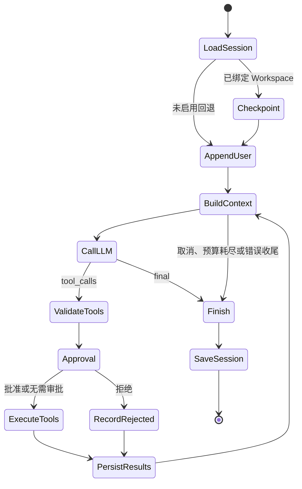

# Agent Runtime

> Agent Runtime 是所有交互入口共享的单回合执行模型：读取 Session、选择后端、运行推理与工具闭环、持久化结果并发布事件。

## 核心入口

原生 Agent 的唯一公共入口是：

```python
run_agent_turn(session_id, user_message, ...)
```

`claw/agent/loop.py` 明确要求用户可见对话不得绕过该函数直接调用 `LLMClient`。Gateway、CLI、QQ、Cron 和 Heartbeat 都将消息路由到这里；Pi / Claude Code 则通过 `RuntimeAgentClient` 在 Session 路由层替换内部执行器。

## 运行时对象图

Gateway 启动时在模块级构建一组共享对象：

```text
RuntimeLLMClient / RuntimeAgentClient
SessionStore
MemoryStore
ContextBuilder
WorkspaceManager
SandboxManager
WorkspaceRollbackManager
ApprovalManager
SkillRegistry
ToolRegistry
CronService
ReflectionManager
PetCatalog / PetProcessManager / PetStateBroker
QQChannel（按配置）
```

共享 Store 使所有入口看到相同的 Session、记忆、Workspace 和任务；请求相关状态通过 Session ID、线程局部变量和 `contextvars` 绑定，避免不同回合串线。

## 一次原生 Agent Turn



### 1. Workspace 回合锁与检查点

传入 `rollback_manager` 时，`run_agent_turn()` 先获取 `turn_guard(session_id)`。该锁覆盖完整回合，避免共享同一 Workspace 的两个 Session 在检查点与文件修改之间交错。

设置 Workspace 不会自动开启回退。只有用户执行 `/rollback on` 后，
当前 Session 才会持久开启并在后续回合创建 Workspace 检查点。
`/rollback off` 会持久关闭、清除已有回退点；显式开关状态在切换
Workspace 后仍保留，`/rollback status` 可查看当前状态。

检查点记录：

- 即将写入的用户消息 ID
- 消息预览
- Workspace 文件快照
- UNLIMITED 下是否只能形成部分检查点

扫描器使用文件大小、纳秒级修改时间和内容对象存在性复用未变化文件，
避免每回合重新读取大文件。新内容在一次流式读取中同时完成 SHA-256
计算与对象写入。文件数量、单文件大小、单次新增数据量和扫描时间均有
可配置预算；达到预算时检查点标记为部分，并禁止根据不完整清单推断删除
额外路径。未缓存文件按体积从小到大排序并由受控线程池捕获，在固定时间
预算内优先覆盖更多小文件。
真正执行回退时会复用刚创建的“回退前安全点”扫描，省去一次重复遍历。
如果安全点只覆盖了部分 Workspace，应用阶段仅修改安全点已捕获且可补偿
的路径，避免覆盖无法由 undo 恢复的大文件或未扫描路径。

然后才进入 `_run_agent_turn_unlocked()`。

> **注意：rollback功能仍不完善，workspace中文件过多时不建议使用。**

### 2. Session 与用户消息

运行时加载 Session，绑定请求上下文，并把用户消息写入内存模型。消息可以携带：

- `media`：图片附件路径
- `message_id`：稳定 ID
- `rollback_checkpoint_id`：回退锚点

关键节点都会调用安全保存包装，尽量保证中途失败后仍能恢复已发生的对话和工具结果。

### 3. Context 构建

每次模型迭代重新调用 `ContextBuilder`，而不是复用第一次构建结果。这样新产生的 Tool Result、Skill 注入、压缩摘要和运行时状态能够进入下一轮。

上下文由以下部分组成：

1. System Prompt
2. Identity、Soul、Platform Policy、Tool Contract
3. 当前时间、主目录、Workspace 和 Sandbox 状态
4. Memory 摘要与近期预览
5. Skill 索引以及已批准 Skill 全文
6. Session 压缩摘要
7. 未压缩的合法消息后缀
8. Tool 定义

### 4. 模型响应解析

`LLMClient.chat_with_tools()` 优先读取 OpenAI 原生 `tool_calls`。若模型不支持原生 Function Calling，则解析文本中的 JSON 协议：

```json
{"type": "tool_call", "tool": "read_file", "args": {"path": "README.md"}}
```

```json
{"type": "tool_calls", "calls": [{"tool": "list_dir", "args": {"path": "."}}]}
```

```json
{"type": "final", "content": "完成。"}
```

普通非 JSON 文本也被视为最终回复。单次模型响应最多接受 `CLAW_MAX_TOOL_CALLS_PER_TURN` 个调用，超出部分截断。

### 5. 工具批次

工具调用先完成：

- 工具名解析
- JSON Schema 子集校验
- 重复调用与拒绝次数检查
- Workspace / SSRF 错误分类
- Skill 选择处理
- 审批判断

标记为 `concurrency_safe` 的只读工具可以并行执行；写入、Shell 和带上下文副作用的工具保持顺序。每个开始与结束都发布事件并写入结构化结果。

### 6. 审批

原生循环把 `write` 和 `shell` 视为需审批级别。

```text
UNLIMITED 开启            → 始终明确审批
AUTO + 任意 write 级工具  → 自动批准
AUTO + microVM 内 Shell   → 自动批准
AUTO + 宿主 Shell         → 明确审批
AUTO + Pi / Claude 原生工具 → 自动批准
AUTO + UNLIMITED          → 始终明确审批
无 approval_handler       → 需要审批的操作直接拒绝
```

同一被拒操作最多允许模型重复尝试 3 次，防止循环施压。

Skill 全文加载使用单独的 `skill_select` 流程：模型先看到索引，选择 Skill 后经确认才把完整内容注入上下文。

### 7. 迭代结束

正常结束条件：

- 模型返回最终文本
- 模型返回有效空回复

非正常结束条件：

- 用户设置 `cancel_event`
- 迭代达到 `CLAW_MAX_AGENT_ITERATIONS`
- 工具或模型持续失败
- 上下文无法形成合法请求
- 重复调用或边界违规无进展

运行时会根据已完成的工具结果生成“成功 / 部分完成 / 失败 / 已终止”简报，避免只留下悬空 Tool Call。

## 事件模型

`claw/agent/events.py` 定义：

| 事件 | 作用 |
| --- | --- |
| `ThinkingEvent` | 新一轮模型思考开始 |
| `ToolCallStartEvent` | 工具即将执行 |
| `ToolCallEndEvent` | 工具成功、失败或被阻止 |
| `FinalEvent` | 最终回复 |
| `ErrorEvent` | 用户可见错误 |

Gateway 把事件编码为 SSE；TUI 直接更新组件；桌宠通过 `PetStateBroker` 将事件转换成动画和气泡；外部 Agent 客户端也生成相同事件类型。

## 预算、指标与健康监控

### 迭代预算

`IterationBudget` 记录已用与剩余迭代。达到上限后不再执行新工具，进入收尾。

### Turn 指标

`TurnMetrics` 记录：

- 总耗时与状态
- LLM 调用次数、耗时、失败和重试
- 工具次数、耗时、失败和缓存命中
- 并行批次
- 迭代数
- 压缩和上下文截断

`TurnMetricsAggregator` 按 Session 汇总最近回合。缓存最多保留 500 个 Session。

### Loop 健康

`LoopHealthMonitor` 观察最近窗口中的错误率、最大迭代命中、重复失败和耗时异常，生成 `HealthAlert`。当前主要用于诊断，尚未形成完整用户面板。

## 并发与取消

- Workspace 回合锁避免同一目录的检查点与修改交错。
- Session Store 自身使用进程内锁和文件锁。
- Gateway 为每个活动 Session 保存取消事件。
- 取消在迭代开始、LLM 返回后和工具批次内多次检查。
- Sandbox Shell 可通过停止 Session microVM 中断。
- Pi / Claude Code 客户端负责终止各自子进程树。

## 外部 Agent 的替换点

`RuntimeAgentClient` 根据 Session 元数据选择：

```text
sjtuclaw → 当前文件描述的原生循环
pi       → PiAgentClient.run_agent_turn()
claude   → ClaudeCodeAgentClient.run_agent_turn()
```

外部客户端仍接收 Session Store、Context Builder、Tool Registry、Approval Handler、事件回调和取消事件，但内部模型与工具循环由外部 Agent 主导。

## 相关页面

- [[concepts/session-context]]
- [[concepts/tool-system]]
- [[concepts/external-backends]]
- [[patterns/security-boundaries]]
- [[products/terminal-ui]]

## 源码依据

- `claw/agent/loop.py`
- `claw/agent/events.py`
- `claw/agent/budget.py`
- `claw/agent/metrics.py`
- `claw/agent/health.py`
- `claw/agent/turn_context.py`
- `claw/gateway/server.py`
- `claw/pi/client.py`
- `claw/claude/client.py`
