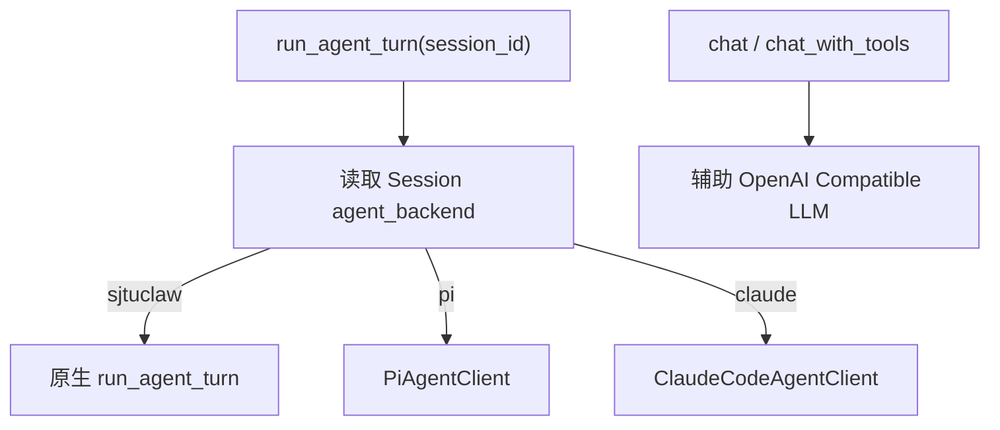
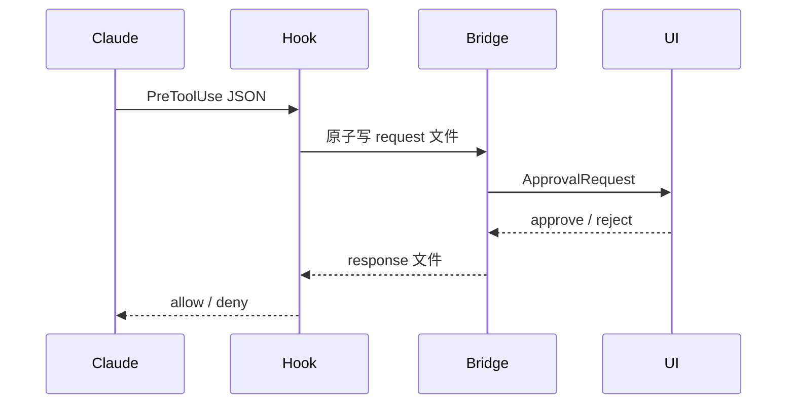

# External Backends

> External Backend 让一个 SJTUClaw Session 把完整主 Agent Turn 委托给 Pi 或 Claude Code，同时保留 SJTUClaw 的入口、Session、审批、事件和宿主工具。

## Session 级路由

有效后端：

```text
sjtuclaw
pi
claude
```

选择保存在 Session Metadata 的 `agent_backend`。`AGENT_BACKEND` 只决定尚未初始化 Session 的默认值；第一次读取后，选择被写入 Session，后续全局设置变化不会悄悄改变旧 Session。

启动迁移会为缺少该字段的旧 Session 固化当前默认后端。

## RuntimeAgentClient

`RuntimeAgentClient` 是三个后端的门面：



外部 Agent 可以在没有原生 LLM 凭证时完成主 Turn；但自动标题、宠物台词、Reflection 等辅助功能仍可能需要原生兼容 LLM。

`SANDBOX_MODE=required` 会在路由层拒绝 Pi 和 Claude，防止外部宿主进程绕过“必须 microVM”的安全承诺。

## 切换与 Generation

从其他后端切换到 Pi 或 Claude 时：

1. 为目标后端生成新的 Session Generation。
2. 清除该后端原生 Session Owner 和 Initialized 标记。
3. Claude 额外清除记录的 CWD。
4. 保存新的 `agent_backend`。

原因是外部 Agent 的旧原生 transcript 没有看到其他后端刚完成的回合。新 Generation 会启动一条新原生分支，并在第一次请求中接收 SJTUClaw 历史交接。

切回 `sjtuclaw` 不删除外部 transcript；下次再切回外部后端时会按切换规则决定新 Generation。

Session Fork 不复制外部 Owner / Generation 临时状态，避免两个 SJTUClaw Session 误用同一个外部 transcript。

## 通用委托协议

Pi 与 Claude 客户端都执行：

1. 根据绑定 Workspace 覆盖 CWD。
2. 读取 Generation 和是否已初始化。
3. 先把用户消息写入 SJTUClaw Session，并 `fsync`。
4. 首次调用时构建历史交接 Prompt。
5. 生成当前回合附加 Prompt 和宿主工具描述。
6. 启动外部进程。
7. 将外部工具事件记录成 SJTUClaw Tool Message。
8. 处理审批、取消和超时。
9. 保存最终 Assistant Message 和延迟。
10. 发布统一 `FinalEvent`。

因此即使外部进程失败，SJTUClaw 仍保留用户请求和用户可见失败回复。

## Pi

### 命令发现

优先级：

1. `PI_COMMAND`
2. `PI_CLI_PATH` + `PI_NODE_PATH`
3. PATH 中的 Pi

Windows 还会寻找可用的 Git Bash，拒绝旧 WSL `bash.exe` 兼容陷阱。

### RPC 启动

每个 Turn 启动 Pi RPC 进程：

```text
pi --mode rpc
   --session-dir <data/pi/sessions>
   --session-id <deterministic-token>
   --extension permission_gate.ts
   --extension sjtuclaw_provider.ts
   --extension sjtuclaw_tools.ts
```

原生 Session 文件存放在 `PI_SESSION_DIR`，默认 `data/pi/sessions`。进程可以结束，后续 Turn 用同一个确定性 Session ID 恢复 transcript。

可选追加：

- `--provider`
- `--model`
- `--thinking`
- `--append-system-prompt`

若 `PI_PROVIDER=sjtuclaw`，桥接 Provider 可以使用项目现有 OpenAI Compatible LLM，并由 `PI_REASONING` 控制 reasoning。

### Prompt 与历史交接

已初始化 Pi Session 只收到当前用户请求。未初始化但 SJTUClaw 已有历史时，Prompt 包含有界的：

- Session 摘要
- 近期合法消息
- 当前请求

交接使用专门标签，防止 Pi 把历史内容当作新指令重复执行。

Context Builder 还生成 Pi 附加 Prompt，提供 Identity、Soul、Workspace、Memory、Skill 索引等 SJTUClaw 背景。

### 图片

Pi 请求可以把本地图片编码为 RPC media block，包含 Base64 数据和 MIME 类型。无效或不可读文件被跳过。

### 事件

Pi JSONL 事件映射为：

- Thinking
- Tool Start / End
- Final
- Error

`_PiToolMessageRecorder` 把工具调用与结果持续写入 Session，而不是等整个 Turn 结束后批量补写。

### 审批与宿主工具

三个 TypeScript Extension 分工：

- `permission_gate.ts`：把危险操作确认请求转发给 SJTUClaw。
- `sjtuclaw_provider.ts`：可选的 LLM Provider 桥接。
- `sjtuclaw_tools.ts`：暴露 Tool Registry 中的宿主工具。

Pi UI Request 通过 RPC 收发确认。`PI_TRUST_TOOLS=true` 允许原生工具绕过 SJTUClaw 审批，但宿主 Tool Registry 仍执行自身参数和路径边界。

### 压缩

`/compact` 为 Pi 启动一次 RPC，并发送：

```json
{"id": "sjtu-compact", "type": "compact"}
```

完成后返回 Pi 原生压缩结果和可用摘要。SJTUClaw 后台 Compaction Worker 不处理 Pi Session。

## Claude Code

### 命令发现

优先级：

1. `CLAUDE_CODE_COMMAND`
2. `CLAUDE_CODE_PATH`
3. PATH
4. `~/.local/bin`
5. 旧 `.claude/local`
6. npm 与常见 Windows 安装目录

支持权限模式：

```text
default
acceptEdits
plan
auto
dontAsk
```

显式跳过审批使用 `CLAUDE_CODE_TRUST_TOOLS=true`，而不是伪造未知 Permission Mode。

### stream-json 启动

每个 Turn 使用：

```text
claude -p
       --output-format stream-json
       --verbose
       --session-id <uuid>     # 首次
       --resume <uuid>         # 后续
```

还可追加：

- `--append-system-prompt-file`
- `--settings`
- `--mcp-config`
- `--model`
- `--permission-mode`

Trust Tools 时追加 `--dangerously-skip-permissions`。

### Session ID 与 CWD

Claude Code 要求 UUID，SJTUClaw 从 Session ID + Generation 稳定生成。已初始化 Session 如果绑定 Workspace / CWD 改变，会生成新 Generation，避免在错误目录恢复旧 transcript。

### Prompt 与图片

Context Builder 为每轮写入临时 Append Prompt。图片不转 Base64，而是把本机绝对路径加入 Prompt，让 Claude Code 使用自身读取能力。

首次接入已有 SJTUClaw Session 时，同样加入有界历史交接。

### Approval Hook

SJTUClaw 为当前回合生成临时 Claude Settings，注册 `PreToolUse` Command Hook。

Hook 流程：



交换目录位于绑定 CWD 内的私有临时位置，文件名随机，Payload 有大小限制并带 Token。Hook 超时、Bridge 不可用或解析失败时拒绝工具。

审批分类区分：

- 明显只读 Shell
- 写入 / 删除 / 执行型 Shell
- Claude 原生文件工具
- MCP 工具
- SJTUClaw Host Tool

AUTO、UNLIMITED 和 Trust Tools 的语义与原生 Runtime 对齐：UNLIMITED 仍强制危险操作确认，AUTO 只在允许范围减少确认。

### Host Tool MCP

当前 Tool Registry 定义写入临时 Manifest。Gateway 为该回合生成额外 MCP 配置：

```text
mcp server name: sjtuclaw_host_tools
transport: stdio
command: 当前 Python + claw/claude/mcp_server.py
```

不使用 `--strict-mcp-config`，因此用户自己的 Claude MCP 仍可用。

MCP Server：

1. 校验 Manifest。
2. 列出 SJTUClaw Host Tool。
3. 将调用写入 Approval Bridge。
4. Bridge 执行 `execute_host_tool()`。
5. 返回 MCP Content。

### 事件与工具持久化

`stream-json` 的 `system/init`、`assistant/tool_use`、工具结果和最终 Result 被映射到统一事件。`_ClaudeToolMessageRecorder` 对未闭合工具调用补写中断结果，避免 Session 中留下 Provider 非法消息结构。

### 进程终止

Windows 下尝试把 Claude 进程加入 Job Object；取消、超时或错误时终止整个子进程树。类 Unix 使用新的 Process Session。

标准输出和错误分别由线程读取，主线程处理 JSON 事件、取消标志和 Approval Bridge。

### 压缩

Claude Code 自动管理原生 transcript 压缩。SJTUClaw `/compact` 只返回说明，不额外启动一个可见 Print Turn，以免污染 Claude 历史。

## 能力对比

| 维度 | 原生 | Pi | Claude Code |
| --- | --- | --- | --- |
| 主循环 | SJTUClaw | Pi | Claude Code |
| 主模型凭证 | `LLM_*` | Pi Provider | Claude 登录 |
| SJTUClaw Session | 完整事实源 | 镜像用户 / 工具 / 最终消息 | 镜像用户 / 工具 / 最终消息 |
| 原生 Transcript | 无额外存储 | `data/pi/sessions` | Claude Code 自身 |
| Host Tool | 直接 Registry | Extension | MCP |
| 危险操作桥接 | Agent Loop | RPC UI Request | PreToolUse Hook |
| 手动压缩 | SJTUClaw Compaction | Pi `compact` RPC | 外部自动管理 |
| microsandbox | 支持 | 不支持 | 不支持 |

## 相关页面

- [[concepts/agent-runtime]]
- [[concepts/tool-system]]
- [[concepts/session-context]]
- [[patterns/security-boundaries]]

## 源码依据

- `claw/pi/client.py`
- `claw/pi/permission_gate.ts`
- `claw/pi/sjtuclaw_provider.ts`
- `claw/pi/sjtuclaw_tools.ts`
- `claw/claude/client.py`
- `claw/claude/mcp_server.py`
- `claw/agent/host_tools.py`
- `claw/session/store.py`
- `claw/context/builder.py`
