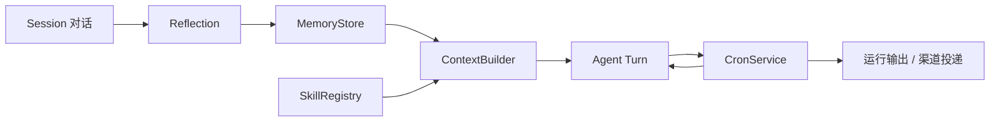

# Memory, Skill and Scheduler

> Memory 保存跨 Session 的长期事实，Skill 提供可复用工作流，Scheduler 把未来时间重新变成 Agent Turn。

## 三者的关系



Memory 和 Skill 在模型调用前进入上下文；Cron 在指定时间重新发起一个带来源 Session 的 Agent Turn。

## Memory

### 存储模型

每条 `MemoryEntry` 对应一个 Markdown 文件：

```text
data/memory/<category>/<slug>.md
```

支持类别：

| 类别 | 用途 |
| --- | --- |
| `user_preference` | 用户稳定偏好 |
| `project` | 项目背景和长期状态 |
| `decision` | 已确认决策 |
| `fact` | 可复用事实 |
| `general` | 其他长期信息 |

核心字段：

```text
memory_id
content
category
tags
importance (1–5)
source_session_id
created_at / updated_at
last_recalled_at
recall_count
```

文件使用 YAML Front Matter 和 Markdown 正文，人可以直接阅读和编辑。

### 启动与迁移

`MemoryStore` 启动时扫描 `*/*.md` 并建立内存索引。如果没有 Markdown 记忆但存在旧 `memory.json`，则迁移为单文件条目，并把旧文件改名为 `.migrated`。

增、改、删在实例锁内完成，写入使用临时文件替换。每次变更递增 Registry 版本，使 Context Builder 的 Memory 缓存失效。

### 检索

`recall()` 不在每次调用时读磁盘，而是搜索内存条目。排序综合：

- 关键词和标签匹配
- 中英文字符匹配
- Importance
- 最近召回与召回次数

召回后更新使用元数据。当前属于结构化词法检索，不是向量数据库。

### 模型工具

- `remember`：校验类别、标签、重要度和来源 Session 后新增。
- `recall`：按查询、类别和数量返回匹配条目。

`remember` 是 `write` 安全级别，需要按普通写入规则审批；Reflection 作为系统任务直接写入 Memory Store，不走用户工具审批。

## Reflection

`ReflectionManager` 每分钟检查一次是否到达配置时间，默认每天 `23:00`。

执行步骤：

1. 找出上次运行后更新的 Session。
2. 为每个 Session 选择摘要与近期可见消息。
3. 加入已有 Memory 作为去重背景。
4. 调用 LLM 提取 JSON 数组。
5. 校验 category、content、tags、importance。
6. 保存不重复的长期事实。
7. 记录运行状态。

配置文件：

```text
data/memory/reflection_config.json
```

保存：

- `enabled`
- `time`
- `lastRunAt`
- 最近 50 条 `runHistory`

命令和 API 均可查看状态、修改时间或立即运行。

## Skill

### 目录约定

每个 Skill 是一个独立目录：

```text
skills/<skill-name>/
├── SKILL.md
├── references/
├── scripts/
└── assets/
```

`SKILL.md` 必须有 YAML Front Matter：

```yaml
---
name: course-report
description: 生成课程报告
metadata:
  claw:
    always: false
    requires:
      bins: []
      env: []
---
```

Registry 也兼容顶层 `always` 和 `requires`。

### SkillInfo

扫描后保存：

- 名称与说明
- 原始内容和去除 Front Matter 的指令正文
- 目录路径
- 文件索引
- `always`
- 所需命令和环境变量
- 可用性与缺失原因

缺少要求的命令或环境变量时，Skill 保留在 Registry 中，但默认从可用索引过滤。

### 渐进披露

Context Builder 不把所有 Skill 全文放入稳定 Prompt，而只放名称、说明和可用性。模型选中后：

1. 解析 Skill 名称。
2. 可选地发起 `skill_select` 审批。
3. 读取完整 `SKILL.md`。
4. 作为 Skill 注入消息加入上下文。
5. 记录使用。

`always: true` 且依赖满足的 Skill 可自动注入。

### 热更新

Registry 记录 `SKILL.md` 与资源文件 mtime。`rescan()` 比较：

- 新增 Skill
- 删除 Skill
- 内容更新
- 依赖状态变化

Registry `version` 改变后，Context Builder 重建 Skill 索引缓存。

### 使用统计与生命周期

操作统计不写进 `SKILL.md`，而保存在：

```text
skills/.usage.json
```

记录 use、view、patch、pin 和最后活动时间。状态：

```text
active → 30 天无活动 → stale → 90 天无活动 → archived
```

Pin 可阻止自动归档。统计写入采用文件锁和原子替换，失败只记录日志，不阻塞主要 Skill 操作。

### 包安装与管理

Gateway 支持上传 Skill ZIP，管理器会检查：

- 包大小和文件数
- ZIP 路径穿越、绝对路径和符号链接
- 顶层目录结构
- `SKILL.md` 存在
- Front Matter 名称和说明
- 文件名与目录名一致

`skill_manage` 可以创建、覆盖、补丁、归档及管理资源文件。Gateway 删除流程会同时移除使用记录。

## Scheduler

### 数据模型

`CronSchedule` 支持：

```text
at     未来绝对毫秒时间
every  固定间隔毫秒
cron   Cron 表达式 + IANA 时区
```

`CronPayload` 支持：

- `system_event`
- `agent_turn`
- 消息文本
- 来源 Session
- 来源渠道、Chat ID 和元数据
- `depends_on` 任务列表

`CronJobState` 保存下一次运行、最近状态、错误、运行历史、暂停原因和调度 Claim。

### Store

```text
data/cron/jobs.json
data/cron/runs/<job-id>/<timestamp>.md
```

`CronService` 使用实例锁、文件锁和原子写入。启动时加载 Store、计算未来时间并设置异步 Timer。

### 调度语义

- `at`：过去时间无效。
- `every`：从当前时刻计算下一次。
- `cron`：用 `croniter` 和指定时区计算。
- 一次性任务可在执行后删除。
- `repeat_times` 限制总调度次数。
- Pause 保存时间和原因；Resume 重新计算下次运行。
- 有限任务通过 Claim 防止崩溃恢复后重复分发。
- 周期任务在执行前预先推进下一次时间，偏向 at-most-once，避免崩溃循环补跑。

### Agent Turn 分发

`create_cron_dispatcher()` 在触发时：

1. 找到绑定 Session；必要时按渠道恢复映射。
2. 标记 Session 活动状态。
3. 绑定线程局部 Session ID 和 Cron RequestContext。
4. 调用 `run_agent_turn()`，用户文本加 `[定时任务: 名称]` 前缀。
5. 保存输出。
6. 通过来源渠道投递。
7. 更新桌宠和活动状态。

定时任务中的 `cron` 工具知道自己处于 Cron 上下文，可防止无约束的递归调度。

### 任务依赖

若 Job 配置 `depends_on`，Scheduler 读取每个依赖任务最新的 Markdown 输出，作为命名区块注入当前任务。依赖缺失时跳过该依赖，不阻止当前 Job。

### Heartbeat

Heartbeat 是 ID 和名称均为 `heartbeat` 的受保护系统任务。

每次触发读取运行数据根目录中的 `HEARTBEAT.md`。只有 `## Active Tasks` 后存在有效内容时才运行 Agent；回复恰为 `All clear.` 时不投递。

Heartbeat Session 只保留配置数量的近期消息，避免监控对话无限增长。

## 相关页面

- [[concepts/session-context]]
- [[concepts/agent-runtime]]
- [[concepts/tool-system]]
- [[patterns/persistence-layout]]
- [[products/terminal-ui]]

## 源码依据

- `claw/memory/store.py`
- `claw/memory/reflection.py`
- `claw/skills/registry.py`
- `claw/skills/usage.py`
- `claw/skills/management.py`
- `claw/tools/skills_tool.py`
- `claw/tools/skill_manager_tool.py`
- `claw/scheduler/types.py`
- `claw/scheduler/service.py`
- `claw/scheduler/dispatcher.py`
- `claw/scheduler/callbacks.py`
- `claw/tools/cron_tool.py`
