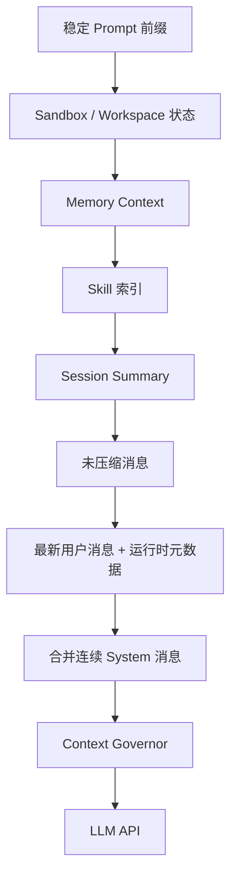

# Session and Context

> Session 保存完整交互事实；Context 是从 Session、Prompt、Memory、Skill 和运行状态投影出的模型输入。

## 数据模型

### Message

`claw.session.models.Message` 的主要字段：

| 字段 | 说明 |
| --- | --- |
| `role` | `user`、`assistant`、`tool` 或 `system` |
| `content` | 持久化文本 |
| `message_id` | 与列表位置无关的稳定 ID |
| `rollback_checkpoint_id` | Workspace 回退锚点 |
| `tool_calls` | Assistant 请求的原生工具调用 |
| `tool_call_id` | Tool Result 对应的调用 ID |
| `name` | 工具名 |
| `timestamp` | ISO 时间 |
| `_command` | Slash Command 或仅显示消息，不回放给模型 |
| `media` | 用户图片的本地路径 |
| `injected_event` | 压缩通知、子任务结果等注入类型 |
| `subagent_task_id` | 注入来源任务 |
| `latency_ms` | Assistant 回合延迟 |

磁盘格式保留内部字段；API `to_dict()` 只暴露界面需要的部分。

### Session

| 字段 | 说明 |
| --- | --- |
| `session_id` | 逻辑主键 |
| `title` | 显示标题 |
| `messages` | 完整原始消息 |
| `summary` | 已压缩旧上下文的摘要 |
| `last_consolidated` | `messages` 中已由摘要覆盖的前缀长度 |
| `skill_usage` | Session 使用过的 Skill |
| `created_at` / `updated_at` | 生命周期时间 |
| `revision` | 每次变更递增，用于丢弃过期异步结果 |
| `metadata` | 后端、运行偏好、标题标志、检查点等扩展状态 |

`last_consolidated` 是上下文投影边界，不是删除计数。`messages[:last_consolidated]` 仍保存在磁盘，可供回退与审计。

## JSONL 存储

每个 Session 使用一个文件：

```text
data/sessions/<base64url-session-id>.jsonl
```

第一行是元数据：

```json
{
  "_type": "metadata",
  "key": "session_1",
  "created_at": "...",
  "updated_at": "...",
  "last_consolidated": 0,
  "metadata": {
    "title": "示例",
    "summary": ""
  }
}
```

后续每行是一条 Message。这样做有三个目的：

1. 单行损坏不会使整个 Session 丢失。
2. 检查与恢复比单个巨大 JSON 更直接。
3. 保留原始工具消息和消息级元数据。

Session ID 在进入缓存和文件系统前检查长度、控制字符与路径分隔符，再编码为文件名。

## 持久化安全

`SessionStore.save()` 使用：

- 进程内同步
- 跨进程 `FileLock`
- 每次写入唯一临时文件
- `os.replace()` 原子替换
- Windows 短暂文件占用重试
- 可选 `fsync`

缓存只在磁盘替换成功后更新，避免内存状态宣称“已保存”而磁盘仍是旧版本。

启动加载时：

- 忽略无法解析的单条消息并记录警告。
- 元数据头无效时拒绝把文件当作合法 Session。
- 旧 `session.json` 自动迁移。
- 恢复中断的运行检查点和 pending user turn。

## Session 生命周期

### 创建与标题

新 Session 生成递增 ID。首个有效用户回合后，`auto_title_if_first_turn()` 可调用模型生成标题；用户手工重命名会设置 `title_user_edited`，防止自动覆盖。

### 分叉

`fork_session_before_user_index()` 复制指定用户回合之前的消息前缀，并调整 `last_consolidated`。

以下状态不复制：

- AUTO 与显式 Sandbox
- 外部 Agent 原生会话 owner / generation
- 运行检查点和 pending turn
- Goal 等临时状态
- 自动标题内部状态

因此分叉得到对话内容的副本，但不会继承高权限或外部子进程身份。

### 删除

删除 Session 时，Gateway 还负责清理相关附件、活动任务、Sandbox 实例和入口侧状态。外部持久资源的处理由对应适配器决定。

## Context Builder

`ContextBuilder.build_messages()` 是唯一组装模型 `messages` 数组的位置。



### 稳定前缀

稳定前缀尽量缓存，便于 Provider Prompt Cache：

- System Prompt
- Identity
- Soul
- Platform Policy
- Tool Contract
- 主目录与 Workspace 说明

Workspace 改变、Prompt 热更新或 Skill Registry 版本改变时，对应缓存失效。

### Workspace 启动文件

有效 Workspace 根目录中如存在以下文件，会作为项目级背景加载：

```text
AGENTS.md
SOUL.md
USER.md
```

这是 Context 资源，不属于 Session 原始消息。

### Memory

Memory 内容放在 `<memory-context>` 标签内，并带有明确系统注释，防止把历史记忆误判为新用户指令。

### Skill

基础上下文只包含 Skill 索引和可用性。模型选择后，完整 `SKILL.md` 作为批准后的注入内容进入当前 Session。

### Summary

压缩摘要以单独 System 区块加入，并明确提示：

- 摘要是已处理过的旧上下文
- 不要重新执行摘要中的任务
- 只响应摘要之后的最新用户请求
- 长期 Memory 仍是权威背景

### 运行时元数据

当前时间、Channel、Chat ID、Sender ID、Workspace / Sandbox 补充信息追加在最新用户文本之后，并由专门标签声明“不是用户指令”。

### 多模态

最新用户消息的 `media` 中，存在、可识别且不超过 10 MB 的本地图片会转换成 OpenAI Compatible `image_url` Data URL。持久 Session 仍只保存路径，不把 Base64 写入 JSONL。

## Context Budget

`ContextBudget` 分别统计：

- System Prompt
- Soul
- Memory
- Tool 定义
- Skill 索引
- Summary
- Conversation Messages

有效上限通常为：

```text
LLM_CONTEXT_WINDOW × LLM_CONTEXT_USAGE_RATIO
```

API 调用前再做最后检查：

- 100%–105%：记录警告。
- ≥105%：抛出 `ContextOverflowError`，拒绝让 Provider 静默截断。

## Context Governor

持久 Session 不一定总是合法的 Provider 输入。例如进程可能在 Tool Call 与 Tool Result 之间退出。`ContextGovernor` 只修改送模副本：

1. 删除无意义 Assistant 占位符。
2. 删除没有有效工具名的调用。
3. 删除孤立 Tool Result。
4. 为缺失结果的 Tool Call 补中断说明。
5. 截断超长工具结果。
6. 上下文溢出时压缩适合压缩的读取 / 联网结果。
7. 仍溢出时从前部裁剪历史。
8. 再次修复工具调用配对。

这一过程不回写原始 Session。

## 持久压缩

### 触发

`CompactionWorker.submit_if_needed()` 同时要求：

- 未压缩消息 Token 超过 `COMPACT_MAX_MESSAGE_TOKENS`
- 存在可安全切分的完整旧对话轮次

仅“会话空闲”不会触发压缩。

### 异步过程

1. 在短锁内复制未压缩消息、摘要和 `revision`。
2. 在线程中调用压缩模型。
3. 真正的摘要失败重试一次。
4. 回到短锁，检查 live Session 的 `revision`。
5. Session 已变化则丢弃过期结果。
6. 否则推进 `last_consolidated`、更新 `summary` 并保存。

### 手动压缩

`/compact` 使用同一摘要逻辑，但以显式 `force=True` 尝试压缩可归档的完整旧轮次。若没有安全切分点，会报告“不需要压缩”，不会破坏消息结构。

### 多轮 Token Consolidation

当上下文明显超预算时，运行时可以多轮归档旧前缀，目标是压到输入预算的一定比例。摘要失败时保留原始消息，并输出诊断，不用空摘要覆盖旧状态。

## 外部后端差异

- Pi 优先调用自身 `/compact`，随后更新 SJTUClaw Session 的交接状态。
- Claude Code 自行管理原生上下文；SJTUClaw 的 `/compact` 返回外部管理说明。
- 原生后台 Compaction Worker 跳过 Pi 和 Claude Session。

## 相关页面

- [[concepts/agent-runtime]]
- [[concepts/memory-skill-scheduler]]
- [[patterns/persistence-layout]]
- [[patterns/security-boundaries]]

## 源码依据

- `claw/session/models.py`
- `claw/session/store.py`
- `claw/session/title.py`
- `claw/context/builder.py`
- `claw/context/budget.py`
- `claw/context/governance.py`
- `claw/context/compaction.py`
- `claw/context/compaction_worker.py`
- `claw/context/token_counter.py`
