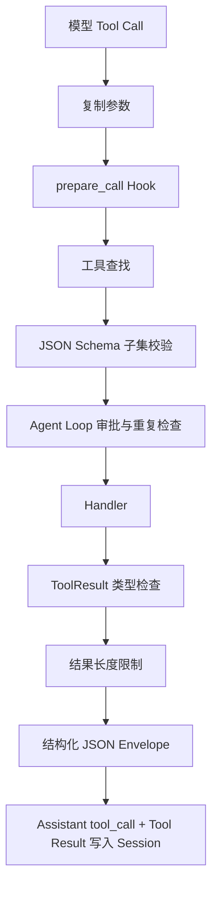

# Tool System

> Tool System 把模型能力表示成带 JSON Schema、安全级别、执行函数和结果约束的统一注册项。

## Tool 数据结构

```python
Tool(
    name,
    description,
    input_schema,
    handler,
    safety_level="read_only",
    concurrency_safe=False,
    max_result_chars=0,
)
```

| 字段 | 作用 |
| --- | --- |
| `name` | 模型调用的稳定名称 |
| `description` | 使用场景和边界 |
| `input_schema` | 顶层必须为 object 的 JSON Schema |
| `handler` | `(args) -> ToolResult` |
| `safety_level` | 审批与路由分类 |
| `concurrency_safe` | 是否可在同批次并行 |
| `max_result_chars` | 单工具输出上限，0 表示使用调用侧策略 |

统一结果：

```python
ToolResult(ok=True, content="...")
ToolResult(ok=False, error="...")
```

成功结果不能同时带 `error`，失败结果不能同时带 `content`。

## Registry

`ToolRegistry.register()` 在启动期检查：

- 必须是 `Tool` 实例
- 名称符合 `[A-Za-z_][A-Za-z0-9_-]{0,63}`
- 名称不重复
- Handler 可调用
- Schema 顶层为 object
- `properties` 是对象

Registry 可以生成两类定义：

- `list_definitions()`：OpenAI Function Calling 格式。
- `list_compact_definitions()`：供文本协议或调试使用的紧凑格式。

## 执行流程



`execute_by_name()` 自身从不向上传播 Handler 异常，而是转换为失败 `ToolResult`。但执行前 Hook 异常被视为安全护栏损坏，必须 fail-closed。

## 参数校验

内置轻量校验支持：

- 必填字段
- `string`、`number`、`integer`、`boolean`、`array`、`object`
- `enum`
- 字符串最小 / 最大长度
- 数字上下限
- 数组数量与元素类型
- 未声明字段拒绝
- `bool` 不冒充 Python `int`
- 浮点数必须有限

Handler 仍负责语义校验，例如路径存在、Cron 时间在未来、宠物 ID 格式等。

## 18 个内置工具

### 基础读取

| 工具 | 安全级别 | 并发 | 作用 |
| --- | --- | --- | --- |
| `current_time` | `read_only` | 是 | 按 IANA 时区返回当前时间 |
| `list_dir` | `read_only` | 是 | 列出 Workspace / Sandbox 目录 |
| `read_file` | `read_only` | 是 | 读取文本文件并限制输出 |

### 联网

| 工具 | 安全级别 | 并发 | 作用 |
| --- | --- | --- | --- |
| `web_search` | `network` | 是 | Tavily、DuckDuckGo、Bing 搜索 |
| `web_fetch` | `network` | 是 | 获取公开 HTTP(S) 文本并提取正文和链接 |

联网工具可由 `WEB_TOOL_ENABLED=false` 整体移除。

### Skill

| 工具 | 安全级别 | 并发 | 作用 |
| --- | --- | --- | --- |
| `skills_list` | `read_only` | 是 | 返回可用 Skill 索引 |
| `skill_view` | `read_only` | 是 | 读取已选 Skill 或其资源文件 |
| `skill_manage` | `write` | 否 | 创建、编辑、补丁、归档和资源管理 |

Agent Loop 还支持特殊的 Skill 选择流程：先由模型选择，再经用户确认注入完整指令。它与 `skill_view` 的低层读取能力分开。

### Memory 与调度

| 工具 | 安全级别 | 作用 |
| --- | --- | --- |
| `remember` | `write` | 新增长期记忆 |
| `recall` | `read_only` | 检索长期记忆 |
| `cron` | `read_only` | 添加、列出和删除 Agent 定时任务 |

`cron` 虽会修改调度 Store，但它被实现为受 `CronService` 约束的领域工具，而非任意文件写入，因此当前声明为 `read_only`，不会走普通文件审批。

### Workspace 写入

| 工具 | 安全级别 | 作用 |
| --- | --- | --- |
| `create_file` | `write` | 仅在文件不存在时创建 |
| `overwrite_file` | `write` | 完整覆盖已有文件 |
| `edit_file` | `write` | 基于精确旧文本的局部替换 |

三者都使用 Workspace / Sandbox 双路由。结构化写入会记录本回合文件状态，用于发现写后仍依赖旧读取的情况。

### Shell

| 工具 | 安全级别 | 作用 |
| --- | --- | --- |
| `new_shell` | `shell` | 初始化或重置 Session Shell 和当前目录 |
| `run_command` | `shell` | 在持久当前目录中执行命令 |

宿主 Shell 在 Windows 使用 PowerShell，在类 Unix 平台使用系统 Shell。Sandbox Shell 使用 `/bin/sh`。

宿主实现会：

- 跟踪每个 Session 的当前目录
- 预检查明显的 `cd` / `pushd` 越界
- 检查命令中的路径模式
- 限制超时和输出
- 丢弃失效 Shell Session

最终权威边界仍由 Workspace 路径解析和实际执行环境决定，词法预检查只是前置保护。

### 附件与交付

| 工具 | 安全级别 | 作用 |
| --- | --- | --- |
| `copy_attachment_to_workspace` | `write` | 把当前 Session 的上传附件复制到 Workspace |
| `create_download` | `download` | 为 Workspace 文件注册 Gateway 下载入口 |

附件工具查找当前 Session 的 `.meta.json`，即使某 ID 存在于其他 Session 也拒绝复制。

下载工具：

1. 在 Workspace 或 guest `/workspace` 内解析文件。
2. Sandbox 文件先导出到受管宿主目录。
3. 在注册表生成下载 ID。
4. 返回唯一的 Markdown 展示入口。

安全位图格式同时生成图片预览；其他文件生成下载链接。

## 条件注册

`register_all_tools()` 根据依赖决定工具集合：

```text
始终注册：
  current_time, list_dir, read_file
  web_search, web_fetch（除非禁用）

提供 SkillRegistry：
  skills_list, skill_view, skill_manage

提供 MemoryStore：
  remember, recall

提供 CronService：
  cron

提供 WorkspaceManager + Session Provider：
  文件写入、Shell、下载

再提供 sessions_dir：
  copy_attachment_to_workspace
```

这使早期 CLI 或测试可以只组装读取工具，而完整 Gateway 注册全部 18 个工具。

## 请求上下文

`RequestContext` 通过 `contextvars` 绑定：

```text
channel
chat_id
message_id
session_key
metadata
```

上下文感知工具可据此把 Cron 绑定到来源 Session 和渠道，而不依赖全局可变“当前会话”。

另有：

- `FileStates`：记录本回合读写。
- `WorkspaceScope`：记录有效项目根、是否限制路径和 Sandbox 状态。

每个 Agent Turn 结束后必须 reset 相应 token，避免线程复用污染后续请求。

## 结果标准化

送回模型的结果统一为：

```json
{"tool": "read_file", "ok": true, "result": "..."}
```

```json
{"tool": "read_file", "ok": false, "result": "错误: ..."}
```

这使原生 Function Calling 和 JSON 回退协议拥有一致观察格式。

超长成功内容和错误都会截断。Context Governor 在模型输入层还会进行第二层工具结果预算控制。

## 边界错误分类

工具错误文本会被识别为：

- SSRF / 私有地址违规
- Workspace 越界
- 普通执行错误

SSRF 被声明为不可绕过，提示模型不要改用编码 IP、代理或 Shell 网络命令规避。Workspace 连续违规达到阈值后，提示用户重新绑定正确目录，而不是继续尝试。

## 外部 Agent 宿主工具

`claw/agent/host_tools.py` 把 Registry 中的 Tool Definition 暴露给外部 Agent：

- Pi 通过其扩展 / RPC 桥接调用。
- Claude Code 通过本地 MCP Server 调用。

外部调用仍进入相同的 Registry Handler、Workspace 和 SJTUClaw 审批策略。外部 Agent 自带的原生工具则由各自审批桥接单独判断。

## 相关页面

- [[concepts/agent-runtime]]
- [[patterns/security-boundaries]]
- [[concepts/external-backends]]
- [[concepts/memory-skill-scheduler]]

## 源码依据

- `claw/tools/base.py`
- `claw/tools/__init__.py`
- `claw/tools/readonly.py`
- `claw/tools/update.py`
- `claw/tools/shell.py`
- `claw/tools/web.py`
- `claw/tools/memory_tools.py`
- `claw/tools/skills_tool.py`
- `claw/tools/skill_manager_tool.py`
- `claw/tools/cron_tool.py`
- `claw/tools/attachment.py`
- `claw/tools/download.py`
- `claw/agent/host_tools.py`
