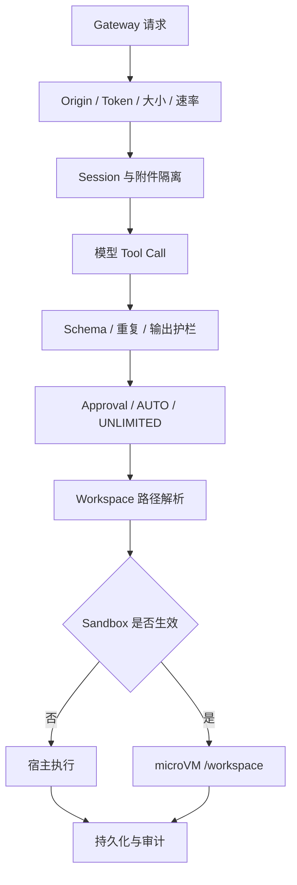

# Security Boundaries

> Security Boundaries 通过“审批决定是否做”和“执行环境决定能在哪里做”两条独立链路降低 Agent 操作风险。

## 边界层次



没有单一“安全开关”。每层解决不同问题，不能用 AUTO、Sandbox 或 Token 代替其他层。

## Approval

### 状态

`ApprovalRequest`：

```text
approval_id
session_id
tool_name
tool_args
status: pending | approved | rejected
reject_reason
created_at
```

`ApprovalManager` 在内存中保存请求和 `threading.Event`。Agent 线程 `wait()`，Web / CLI / QQ 线程调用 `approve()` 或 `reject()` 唤醒。

等待默认 300 秒，超时自动拒绝。完成项保留 10 分钟，且最多保留约 200 条，防止长运行进程无限增长。

### 原生工具规则

默认需要批准：

```text
safety_level = write
safety_level = shell
```

不需要普通危险操作审批：

```text
read_only
network
download
```

Download 的用户确认发生在点击交付链接时；注册本身仍受 Workspace 路径约束。

### 无审批通道

如果当前入口没有 `approval_handler`，需要批准的操作被拒绝。省略 Callback 绝不表示默认同意。

### 停止任务

停止活动 Turn 时：

- 设置 Cancel Event
- 关闭该 Session microVM 以中断 Shell
- 拒绝该 Session 的 Pending Approval

因此不会留下永久等待的 Agent 线程。

## AUTO

AUTO 是 Session 级“减少确认”偏好：

```text
所有 safety_level=write 工具 自动批准
实际在 microsandbox 内 Shell 自动批准
宿主 Shell                  仍需批准
Skill 选择                  仍按 Skill 流程
```

这包括文件写入，也包括 `remember`、`skill_manage` 和附件复制等声明为 `write` 的领域工具。AUTO 不：

- 解除 Workspace
- 允许访问其他 Session 附件
- 绕过 SSRF
- 让显式 Sandbox 回退宿主
- 覆盖 UNLIMITED 下的强制批准

状态保存在 Session Metadata 的 `runtime_auto_enabled`，重启后恢复；Fork 不继承。

## UNLIMITED

UNLIMITED 是 Session 级、进程内的宿主路径越界能力：

- `WorkspaceManager.require()` 返回文件系统根。
- `resolve()` 不再拒绝绝对路径和 `..`。
- 写入、覆盖、删除和 Shell 始终逐次批准。
- AUTO 无法跳过这些批准。
- 进程重启后关闭。
- 取消 Workspace 绑定时同步关闭。

UNLIMITED 与 Sandbox 不兼容，`SANDBOX_MODE=required` 下禁止开启。

回退检查点无法覆盖 Workspace 外部改动，因此 UNLIMITED 回合标为 `partial`，预览和结果都显示警告。

## Workspace

`WorkspaceManager` 保存 Session 到目录的持久映射：

```text
data/workspace/bindings.json
```

绑定时：

1. 立即把相对路径解析成绝对目录。
2. 验证目录存在。
3. 在文件锁内重读最新磁盘映射。
4. 只修改当前 Session 项。
5. 原子替换文件。

每次重读可避免 CLI 与 Gateway 两个进程用各自旧快照互相覆盖。

### 路径解析

默认 `resolve(session_id, path)`：

- 必须已有 Workspace
- 拒绝绝对路径
- 规范化 `workspace / path`
- 用 `relative_to(workspace)` 验证没有越界
- 可选要求目标存在

这是文件工具的权威边界。Agent Loop 中对绝对路径和 `..` 的词法检测仅用于诊断和审批提示。

### 绑定持久性

启动恢复时，即使目录暂时不存在也保留绑定，不会静默换到其他目录。实际使用时再返回清晰错误。

## Workspace Rollback

回退是恢复与审计边界，不是 Git 包装。

### 快照

每个用户回合之前创建：

- Workspace Manifest
- 文件内容 SHA-256
- Session Conversation Snapshot
- 目标 Message ID
- Parent Checkpoint

排除：

```text
.git, .hg, .svn
.venv, .venv-build
node_modules
常见测试与静态分析缓存
```

内容保存在压缩的内容寻址 Object Store，相同文件只保存一次。

### 锁

锁按规范化 Workspace 路径，而不是只按 Session ID。两个 Session 绑定同一目录时，不能交错：

```text
创建检查点 → Agent 文件修改 → Session 保存
```

### 恢复事务

SQLite 使用 WAL，记录：

- Binding Generation
- Checkpoint
- Operation Journal
- Safety Checkpoint

恢复前先创建 Safety Checkpoint。若进程在恢复中退出，启动时读取 Operation Journal 并用 Safety Checkpoint 补偿。Workspace 绑定 Generation 已改变时，拒绝把旧快照恢复到新目录。

### 对话分支

恢复 Checkpoint 时，工作区回到用户消息之前，同时 Session 可见历史切到对应分支。原始 JSONL 和 Checkpoint 事实不被当作普通“删除聊天”处理。

`undo` 使用最近一次恢复前的 Safety Checkpoint；开始新用户回合后撤销资格失效。

## Sandbox

Sandbox 把执行环境从宿主换成 microVM，但不替代 Approval。

### 覆盖

仅覆盖原生 Agent 的：

- 结构化文件工具
- Shell
- 附件导入
- 文件导出

联网、Memory、Skill 和 Cron 服务仍在宿主。

### 显式要求

以下情形 fail-closed：

- `/sandbox on`
- `SANDBOX_MODE=required`

如果运行时不可用、后端不是原生 Agent、UNLIMITED 开启、镜像失败或旧实例无法停止，则拒绝操作。

只有 `auto` 的隐式默认在 microsandbox 不可用时允许保留原宿主 Workspace 行为。

### Guest 路径

结构化工具必须在 `/workspace`。拒绝：

- Windows 盘符
- UNC
- `/workspace` 之外的绝对路径
- 规范化后越界的 `..`

Shell 可以访问 guest 内其他路径，但那些路径不是宿主挂载。

完整实现见项目级 [Sandbox 架构](../../sandbox-architecture.md)。

## SSRF 与 Web

`web_fetch` 只接受公开 HTTP(S) URL。

验证包括：

- 禁止 URL 用户名 / 密码
- 禁止 localhost、`.local`、`.internal`
- IP Literal 必须是公网
- DNS 解析后的目标必须是公网
- 重定向逐跳重新检查
- 连接目标与 Host / SNI 分离，降低 DNS Rebinding
- 响应流按字节上限读取
- 只接受文本 Content-Type
- 默认不信任系统代理

搜索结果先做便宜 URL 过滤和去重，真正 Fetch 时再做完整 DNS 验证。

边界错误会明确告诉模型不要用 Shell、编码 IP 或代理绕过。

## Gateway

### 网络暴露

- 默认只监听 `127.0.0.1`。
- 非回环监听必须配置 Token。
- 非回环客户端每个 API 请求都需要 Token。
- Browser Origin 必须在精确允许列表。
- CORS 不使用通配符。

### 资源限制

- 普通请求体：10 MB。
- 附件与宠物包：50 MB 加表单余量。
- 限流：每客户端 300 次 / 60 秒。
- 限流 Client Bucket 有总数上限和过期清理。
- 错误响应脱敏，不返回本机路径或密钥。

### 内部桌宠

只有回环客户端、固定路径和固定内部 Header 同时满足时，才视为桌宠内部请求。

## 上传、ZIP 与下载

### 附件

- 随机保存名
- 安全后缀
- 流式大小限制
- Session 独立目录
- Attachment ID 不能跨 Session 使用

### Skill / Pet ZIP

- 禁止绝对路径与 `..`
- 禁止符号链接和加密项
- 限制文件数、压缩后 / 解压后大小和压缩比
- 只允许预期文件集合
- Pet 额外验证真实图片格式、透明通道、尺寸和动画格

### 下载

下载 URL 只接受注册 ID，不接受任意路径。Registry 查到源文件且源文件仍存在时才返回 `FileResponse`。

## 运行设置与密钥

Web UI 设置中的敏感字段使用 Fernet：

```text
runtime_settings.json  密文
runtime_settings.key   本地 Key
```

写入使用唯一临时文件和原子替换。API 只返回掩码，不把明文发给浏览器。

`.env` 仍可作为 Bootstrap，但必须被 Git 忽略。

## 外部 Agent

外部 Agent 有两类工具：

1. SJTUClaw Host Tool：始终回到 Registry 和 Workspace。
2. 外部 Agent 原生工具：由 Pi Extension 或 Claude Hook 桥接审批。

Trust Tools 会弱化第二类审批，因此配置名明确带 `TRUST_TOOLS`。即使 Trust 开启，Gateway、附件、Host Tool 参数和 Workspace 等边界仍然生效。

## 相关页面

- [[concepts/tool-system]]
- [[concepts/external-backends]]
- [[patterns/persistence-layout]]
- [[concepts/agent-runtime]]
- [[products/terminal-ui]]

## 源码依据

- `claw/approval/manager.py`
- `claw/workspace/manager.py`
- `claw/workspace/rollback.py`
- `claw/sandbox/config.py`
- `claw/sandbox/runtime.py`
- `claw/tools/base.py`
- `claw/tools/web.py`
- `claw/gateway/middleware.py`
- `claw/gateway/uploads.py`
- `claw/runtime_settings.py`
- `claw/pi/client.py`
- `claw/claude/client.py`
