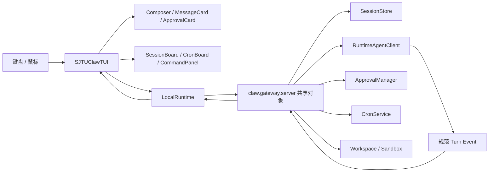

# Terminal UI

> `claw/tui/` 是 SJTUClaw 基于 Textual 的键盘优先终端驾驶舱，在同一进程内复用 Gateway 的规范运行时与命令实现。

## 核心能力

- 全屏流式对话，展示思考、工具调用、结果、耗时、错误和最终回复。
- Session Board 支持搜索、新建、切换、重命名和带确认删除。
- Cron Board 支持查看、立即运行、启停和带确认删除。
- 20 个 Slash Command 命令族可通过行内补全或可搜索面板访问。
- 待审批工具以内联卡片显示，可在 Agent 运行期间批准或拒绝。
- 输入历史和未发送草稿按 Session 隔离，界面随终端宽高响应式调整。

## 源码地图

| 文件 | 责任 |
| --- | --- |
| `claw/tui/__init__.py` | 创建并运行 `SJTUClawTUI` |
| `claw/tui/__main__.py` | `python -m claw.tui` 入口 |
| `claw/tui/app.py` | 应用状态、布局、看板、事件、Worker 和运行时同步 |
| `claw/tui/runtime.py` | 共享 Gateway Runtime 的进程内适配 |
| `claw/tui/widgets.py` | Composer、消息、欢迎页、页头和审批组件 |
| `claw/tui/quotes.py` | 欢迎页计算机科学语录 |
| `claw/tui/sjtuclaw.tcss` | 主题、组件布局和响应式规则 |
| `tests/test_tui.py` | Textual Pilot 交互、并发、渲染与清理测试 |

命令入口位于 `claw/cli/main.py::_cmd_tui()`：

```text
sjtuclaw tui
→ claw.tui.main()
→ SJTUClawTUI().run()
```

## 运行时架构



`LocalRuntime` 延迟导入 `claw.gateway.server`。这使 TUI 与 Gateway 使用同一组模块级 Store、Manager、Registry 和处理函数，同时避免复制业务规则。

TUI 不启动 FastAPI Server，也不经过网络套接字。流式回合仍调用规范的 `handle_chat_stream()`：它在进程内消费 `StreamingResponse.body_iterator`，解析 `data:` SSE 包并把 JSON Event 交给界面。因此 Web 与 TUI 共享同一事件编码和完成语义。

## 生命周期

### 启动

`SJTUClawTUI.on_mount()`：

1. 调用 `LocalRuntime.start()`。
2. 启动共享 `CronService`。
3. 启动 `ReflectionManager`。
4. 应用当前终端尺寸对应的响应式 Class。
5. 聚焦 Composer。
6. 注册 0.75 秒和 5 秒两个轮询任务。
7. 首次同步状态、历史、Transcript 和审批。

如果 Reflection 启动失败，而 Cron 已经启动，`LocalRuntime.start()` 会先停止 Cron 再把异常抛给上层，避免半初始化状态。

### 退出

`on_unmount()` 调用 `LocalRuntime.close()`，依次尝试：

- 停止 Cron
- 停止 Reflection
- 关闭全部 Sandbox

每一步独立捕获并记录错误；某一步失败不会阻止后续资源清理。最后无条件清除 `_started`，使生命周期状态可再次建立。

## 主界面组件树

```text
SJTUClawTUI
├─ BrandHeader
├─ top-status
│  ├─ run-state
│  ├─ session-title
│  ├─ backend-pill
│  └─ safety-pill
├─ workspace-shell
│  ├─ conversation
│  │  ├─ transcript
│  │  ├─ inline-approval-list
│  │  ├─ command-hints
│  │  ├─ composer-shell
│  │  │  └─ Composer
│  │  └─ composer-meta
│  └─ insight-rail
│     ├─ runtime-card
│     └─ cron-glance
└─ keybar
```

状态栏显示 Session 标题、运行状态、后端和安全模式。后端标签区分 `sjtuclaw`、`pi`、`claude`；安全标签组合显示 `SANDBOX`、`AUTO` 和 `UNLIMITED`，没有特殊模式时显示 `GUARDED`。

右侧 Rail 显示模型、Workspace、后端以及最多 4 个 Cron 摘要。`RuntimeSnapshot` 是不可变数据类，负责把 Runtime 状态收敛成界面所需的最小字段集合。

## 响应式布局

`_apply_responsive_classes()` 根据终端尺寸设置三个 Class：

| 条件 | Class | 主要变化 |
| --- | --- | --- |
| 宽度 ≤ 110 | `compact` | 隐藏右侧 Rail，压缩审批卡 |
| 宽度 ≤ 78 | `narrow` | 缩小 Transcript 边距，隐藏模式标签和发送提示 |
| 高度 ≤ 28 | `short` | 压缩 Composer、状态区和审批区 |

审批区位于对话区内部、Composer 上方。即使在 60 × 16 的小终端中，批准和拒绝按钮也不会被输入框覆盖。

## Composer

`Composer` 继承 Textual `TextArea`，改变了终端聊天输入的默认语义：

| 输入 | 行为 |
| --- | --- |
| `Enter` | 提交非空内容 |
| `Ctrl+N` | 插入换行 |
| `Ctrl+M` | 明确拦截且不提交 |
| `↑` / `↓` | 多行内部先移动光标；到首行或末行后浏览发送历史 |
| `Tab` | 接受当前 Slash Command 补全 |

每个 Session 最多保留 200 条输入历史。`SJTUClawTUI` 使用 `_input_histories` 和 `_composer_drafts` 分别保存逐 Session 历史与草稿；切换 Session 时先保存旧草稿，再恢复目标 Session 的草稿和历史。

历史首次加载时从 Session 中的用户消息重建。连续相同输入不会重复追加。

## 命令系统

`COMMANDS` 提供 20 个顶级命令：

```text
/session     /memory       /compact      /workspace
/sandbox     /rollback     /approvals    /approve
/reject      /skill        /reflect      /cron
/pet         /auto         /unlimited    /pi
/claude      /stop         /help         /exit
```

该列表由测试与 `claw/cli/commands.py` 的命令命名空间比对，防止 TUI 漏掉 CLI 已支持的能力。

### 行内命令提示

当输入以 `/` 开头且尚未出现空格或换行时：

1. 按前缀筛选命令。
2. 最多显示以当前选项为中心的 7 条。
3. `↑` / `↓` 循环选择。
4. `Tab` 接受补全。
5. `Enter` 在内容尚未等于所选命令时先补全，而不是立即执行。
6. `Esc` 关闭提示，但保留草稿。

### 命令面板

`Ctrl+P` 打开独立 `CommandPanel`，可按命令名和中文说明搜索。选中项只负责插入 Composer，不绕过正常命令提交路径。

若 Composer 已包含普通草稿，面板不会覆盖它；若只有尚未完成的 Slash Command，则用面板选择替换。

### 命令并发

`_command_running` 防止第二个命令取消或覆盖仍在执行的修改型命令。Agent 回合运行期间只允许：

- `/stop`
- `/approvals`
- `/approve`
- `/reject`

其他命令与普通消息会被拒绝提交，输入草稿保持不变。

## Session Board

`Ctrl+S` 打开 `SessionBoard`。表格字段包括：

- 当前 Session 标记
- 标题
- 最近消息预览
- 消息数
- 更新时间

搜索同时匹配 Session ID、标题和预览。`N` 新建，`E` 重命名，`X` 删除，`J` / `K` 移动，`R` 刷新，Enter 切换。

看板本身不直接修改 Store，而是生成规范 Slash Command，例如：

```text
/session new
/session switch <session-id>
/session rename <session-id> <title>
/session delete <session-id>
```

重命名使用独立输入对话框。删除使用危险操作确认框，并默认聚焦“取消”。删除当前 Session 后，如果 Command Response 返回 `clear_session`，TUI 会选择仍存在的首个 Session；若没有则创建默认 Session。

Session 切换还会清除瞬时消息、同步草稿和历史，并重新渲染 Transcript。

## Cron Board

`Ctrl+J` 打开 `CronBoard`。`LocalRuntime.cron_jobs()` 把三种 Schedule 统一格式化：

- `cron`：表达式和时区
- `every`：间隔秒数
- `at`：本地日期时间

看板展示启用状态、名称、计划、下次运行、上次状态和 Job ID。系统任务使用 `◆` 标记。

操作语义：

- Enter 通过 `trigger_cron(..., force=True)` 立即运行。
- Space 生成 `/cron enable` 或 `/cron disable`。
- X 对用户作业打开删除确认框。
- 系统作业拒绝删除并显示警告。

立即运行使用独立 `cron-run` Worker，避免阻塞 Textual Event Loop。

## Agent Turn 与流式事件

`execute_turn()` 是 `exclusive=True` 的 `turn` Worker：

```text
设置 busy
→ 记录持久消息基线
→ 立即显示用户瞬时消息
→ LocalRuntime.stream()
→ 映射并渲染每个事件
→ Gateway 持久化追上后去重
→ 刷新完整状态
→ 清除 busy 并恢复 Composer 焦点
```

事件映射：

| Event | TUI 表现 |
| --- | --- |
| `ThinkingEvent` | 显示当前迭代的思考状态 |
| `ToolCallStartEvent` | 显示工具名和格式化参数 |
| `ToolCallEndEvent` | 显示成功或失败、结果摘要和耗时 |
| `ErrorEvent` | 追加运行警告 |
| `_session_info` | 同步规范 Session ID |
| `_title` | 更新自动生成标题 |
| `_done` | 结束流式消费 |

工具结果的瞬时展示限制为 1600 字符，持久 Tool Call 参数卡限制为 2000 字符，防止超长结果破坏终端布局。完整结果仍由共享 Session 和工具持久化逻辑管理。

`Ctrl+C` 调用 Gateway 的 `handle_stop()`。界面只显示一条简短状态通知，实际取消传播由共享 Agent Runtime、Sandbox 或外部 Agent 客户端处理。

## Transcript 一致性

TUI 同时面对两类消息：

1. 已由 Gateway 写入 Session 的持久消息。
2. 为即时反馈而创建的 `_ephemeral_messages`。

`_unpersisted_ephemeral_messages()` 从本回合开始时的消息数量建立窗口，用角色和内容计数抵消已经持久化的瞬时副本，从而避免同一用户消息或工具结果显示两次。

渲染时对每条可见消息计算 Fingerprint：

```text
role + name + content + canonical tool_calls JSON
```

`_common_prefix_length()` 找到旧列表和新列表的公共前缀，只删除发生变化的尾部组件并追加新 `MessageCard`。这带来三个效果：

- 未变化的消息组件保持实例不变。
- 长对话无需每次整页重建。
- 用户主动向上滚动时，新消息不会强制拉回底部；切换 Session 或原本已在底部时才自动滚动。

空 Session 显示 `WelcomePanel`，其中包含随机计算机科学语录和入口提示。

## 消息渲染

`MessageCard` 根据角色区分用户、助手、工具、系统和 Tool Request：

- Assistant 与 System 内容使用 Rich Markdown。
- User 和 Tool 内容关闭 Markup，按原文安全显示。
- Tool Request 解析 Function Arguments；合法 JSON 使用缩进格式。
- 无正文但包含 `tool_calls` 的 Assistant 消息仍会显示工具名和参数。

这保证持久化历史和实时工具活动使用一致的视觉语义。

## 审批

`LocalRuntime.pending_approvals()` 只返回当前 Session 的 `pending` 请求。`ApprovalCard` 显示工具名、参数以及批准和拒绝按钮。

安全与可用性规则：

- 参数详情最多展示 20,000 字符，并放入独立滚动区域。
- Approval 列表的序列化内容未变化时不重新挂载卡片，避免轮询导致焦点和滚动位置丢失。
- 运行期间每 0.75 秒刷新审批，使阻塞中的工具可以及时继续。
- 批准与拒绝直接调用共享 `ApprovalManager`。
- TUI 拒绝原因记录为“用户在 TUI 中拒绝”。
- UI 异常只重置渲染键并记录错误，不让 Agent Turn 崩溃。

审批策略本身仍由 [[patterns/security-boundaries]] 定义；TUI 只是一个明确的用户决策通道。

## 后台同步

TUI 使用两个定时器：

| 周期 | 条件 | 内容 |
| --- | --- | --- |
| 0.75 秒 | Agent 正在运行 | 刷新待审批操作 |
| 5 秒 | Agent 空闲 | 同步 Session、运行模式、Cron 和审批 |

如果后台同步发现当前 Session 已失效，`RuntimeSnapshot` 会回退到默认 Session；应用随后切换历史、草稿并刷新 Transcript。

## Worker 分组

| Worker Group | 策略 | 目的 |
| --- | --- | --- |
| `turn` | `exclusive=True` | 同一界面只运行一个 Agent Turn |
| `approval-render` | `exclusive=True` | 新审批状态替换旧渲染任务 |
| `session-refresh` | `exclusive=True` | 合并重复刷新 |
| `command` | 非 exclusive，另由 `_command_running` 串行化 | 不取消正在修改状态的命令 |
| `cron-run` | 独立 | 立即运行 Cron 时保持 UI 响应 |

这种区分很重要：Textual 的 Exclusive Worker 会取消同组旧任务，因此修改型命令不能仅依赖 Exclusive，而要显式拒绝第二条命令。

## 测试边界

`tests/test_tui.py` 使用 Textual `run_test()` 和 Pilot 覆盖：

- 主布局与响应式阈值
- Slash Command 命名空间完整性
- 行内命令提示和命令面板
- 多行光标、输入历史、草稿隔离
- Busy 状态下保留草稿与处理审批
- Session 搜索、切换、重命名和删除
- Cron 查看、立即运行、启停和删除确认
- 小终端审批按钮可见性
- 流式 Event 完成与瞬时消息去重
- 持久 Tool Request 参数渲染
- Transcript 组件复用
- 启动失败回滚和退出清理容错

这些测试使用 `FakeRuntime`，验证 UI 协议而不依赖真实模型、网络或交互式终端。

## 扩展指南

### 新增顶级 Slash Command

1. 先在 `claw/cli/commands.py` 实现规范命令。
2. 在 `COMMANDS` 增加名称与说明。
3. 确认 Busy 状态是否允许执行；只有纯控制或审批命令应加入 `BUSY_COMMANDS`。
4. 扩充命令 Atlas 与交互测试。

### 新增 Turn Event

1. 在共享 Runtime 中定义并发布 Event。
2. 在 `execute_turn()` 增加瞬时展示映射。
3. 判断内容是否最终由 Session 持久化。
4. 若会持久化，确保瞬时消息可以被去重。

### 新增看板操作

优先生成规范 Slash Command，通过 `LocalRuntime.command()` 执行。只有“立即运行 Cron”这类已有专用共享处理函数的动作才直接调用对应 Facade 方法，避免 TUI 与 Web / CLI 产生不同业务语义。

## 相关页面

- [[concepts/gateway-clients]]
- [[concepts/agent-runtime]]
- [[concepts/memory-skill-scheduler]]
- [[patterns/security-boundaries]]
- [[patterns/persistence-layout]]
- [[concepts/external-backends]]

## 源码依据

- `claw/tui/__init__.py`
- `claw/tui/__main__.py`
- `claw/tui/app.py`
- `claw/tui/runtime.py`
- `claw/tui/widgets.py`
- `claw/tui/quotes.py`
- `claw/tui/sjtuclaw.tcss`
- `claw/cli/main.py`
- `claw/cli/commands.py`
- `claw/gateway/server.py`
- `tests/test_tui.py`
