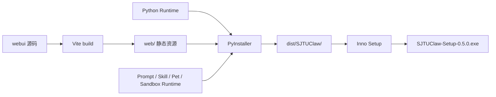

# Windows Distribution

> Windows Distribution 把同一套 Gateway + Web UI Runtime 封装为无控制台桌面程序，并用标准安装向导分发。

## 分发链



## Desktop Launcher

`claw/desktop.py` 是 PyInstaller 主入口。

源码环境通过统一 CLI 启动桌面窗口：

```powershell
sjtuclaw desktop
```

### 启动过程

1. 创建 `%USERPROFILE%\.sjtuclaw`。
2. 解析隐藏内部参数。
3. 选择 Gateway Port。
4. 强制 Gateway 监听 `127.0.0.1`。
5. 后台线程启动 Uvicorn。
6. 轮询本地 URL，确认 Gateway 已可访问。
7. 打开 pywebview。
8. 窗口退出后请求 Uvicorn Graceful Shutdown。

端口选择优先使用 `GATEWAY_PORT`，若已占用则绑定系统分配的空闲端口。

### 窗口

```text
title: SJTUClaw
size: 1280 × 820
minimum: 960 × 640
backend: Edge Chromium
text selection: enabled
```

图标优先级：

1. EXE 同目录 `SJTUClaw.ico`
2. 打包资源图标
3. Web Favicon

### 启动错误

Desktop EXE 是 Windowed 程序，没有控制台。启动错误：

- 写入 `%USERPROFILE%\.sjtuclaw\logs\desktop.log`
- Windows 上显示 MessageBox
- Gateway 未在 20 秒内就绪则终止

### WebView2 恢复

启动后注册 `ProcessFailed` Handler。主 Render Process 异常退出时自动 Reload，但在 60 秒窗口最多尝试 2 次，避免崩溃循环。

### 无 pywebview 回退

源码环境缺少 pywebview 时，Launcher 打开系统浏览器并保持 Gateway；发布构建会包含 pywebview。

## 内部运行模式

同一个 EXE 支持隐藏参数：

| 参数 | 作用 |
| --- | --- |
| `--pet` | 进入桌宠子进程入口 |
| `--server-only` | 只运行 Gateway |
| `--sandbox-self-test-report` | 执行冻结版真实 Sandbox 自检 |
| `--sandbox-self-test-workspace` | 自检 Workspace |

桌宠使用同一 EXE 避免再打包一个完整 Python 程序。

Sandbox 自检把模式强制替换为 `required`，实际创建 microVM、运行命令、写 JSON 报告并清理资源。

## PyInstaller Spec

入口：

```text
claw/desktop.py
```

输出为 Onedir：

```text
dist/SJTUClaw/SJTUClaw.exe
```

### Data

显式收集：

```text
web/
prompts/
skills/
claw/pet/assets/
claw/pi/*.ts
claw/sandbox/project_env_sync.py
.env.example
```

`project_env_sync.py` 必须作为真实文件存在，因为运行时要读取其字节并复制到 guest；仅放进 PyInstaller PYZ 不够。

### Hidden Import

收集：

- Uvicorn 子模块
- pywebview 子模块
- Gateway / Desktop / Pet
- Tkinter

排除 PyQt / PySide，避免构建环境中多个 Qt Binding 相互冲突。Windows GUI 使用 pywebview Edge Chromium，宠物使用 Tk。

### Conda 兼容

Conda 环境中，Spec 额外收集 `Library/bin` 的：

- Tcl / Tk
- SQLite
- OpenSSL / Crypto
- ffi、bz2、lzma、expat、mpdecimal

否则显式 Python 或叠加 Venv 的 PyInstaller 可能漏掉这些 DLL。

### microsandbox

Spec 使用 `collect_all("microsandbox", on_error="raise")` 并验证：

```text
microsandbox._microsandbox
msb.exe
libkrunfw.dll
```

缺少任一关键文件时构建失败，不生成“能打开但不能运行 Sandbox”的安装包。

## 构建脚本

`packaging/windows/build.ps1`：

```text
参数：
  -PythonExe <path>
  -SkipInstaller
```

Python 搜索顺序：

1. 显式 `-PythonExe`
2. `.venv-build\Scripts\python.exe`
3. `.venv\Scripts\python.exe`
4. `python`

流程：

```text
webui: npm ci
webui: npm run build
pip install -e ".[build]"
Tkinter 窗口自检
PyInstaller --noconfirm
查找 ISCC.exe
编译 Inno Setup
```

Inno Setup 未安装时，脚本保留成功的 PyInstaller 输出并给出提示，而不是把应用构建判为失败。

## Inno Setup

`SJTUClaw.iss` 定义：

```text
AppId: 固定 GUID
Version: 0.5.0
Architecture: x64 compatible
Privileges: lowest
DefaultDir: Program Files 自动选择
Compression: LZMA solid
Languages: 简体中文、英文
```

安装内容：

- 整个 `dist/SJTUClaw/`
- 独立 `SJTUClaw.ico`

快捷方式：

- 开始菜单应用
- 开始菜单卸载
- 可选桌面图标

安装完成页允许直接启动应用。

## 只读资源与可写数据

安装目录中的资源视为只读：

```text
<install>/
├── SJTUClaw.exe
├── web/
├── prompts/
├── skills/
└── ...
```

用户数据：

```text
%USERPROFILE%\.sjtuclaw/
├── .env
├── data/
└── logs/desktop.log
```

首次访问 Prompt 和 Skill 时，打包资源复制到 Data Root 的可写目录。Web 静态文件仍从安装资源加载。

覆盖升级只替换应用目录，不删除 `.sjtuclaw`。卸载程序同样不清理用户数据。

## 外部依赖边界

安装包包含：

- Python Runtime
- Python 依赖
- Web UI
- microsandbox SDK 和 `msb` Runtime

安装包不包含：

- Sandbox OCI 镜像
- Pi CLI / Node Runtime
- Claude Code
- 用户模型凭证
- WebView2 系统组件的独立离线安装包

目标机使用 Sandbox 还需要：

- Windows Hypervisor Platform
- 已导入镜像

使用 Pi / Claude 需要分别安装外部 Agent。

## 版本同步点

发布前必须同步：

```text
pyproject.toml                  project.version
packaging/windows/SJTUClaw.iss MyAppVersion
README.md                      显示版本
```

Gateway 的 FastAPI Version 属于 API 描述版本，不等于应用发布版本。

## 发布验证

### 自动化

```text
完整 pytest
Vitest
TypeScript + Vite Build
PyInstaller Build
Inno Setup Compile
```

### 冒烟

- 未配置 LLM 时设置界面可打开
- 设置可加密保存
- 原生 / 外部 Agent 可按条件运行
- Session 重启恢复
- 附件与下载可用
- 桌宠子进程可启停
- WebView2 崩溃日志路径可写
- 安装和覆盖升级保留用户数据
- Frozen Sandbox Self Test 成功

## 相关页面

- [[concepts/gateway-clients]]
- [[patterns/persistence-layout]]
- [[patterns/security-boundaries]]
- [[concepts/external-backends]]

## 源码依据

- `claw/desktop.py`
- `claw/paths.py`
- `claw/pet/process.py`
- `claw/pet/__main__.py`
- `packaging/windows/build.ps1`
- `packaging/windows/SJTUClaw.spec`
- `packaging/windows/SJTUClaw.iss`
- `pyproject.toml`
- `webui/vite.config.ts`
