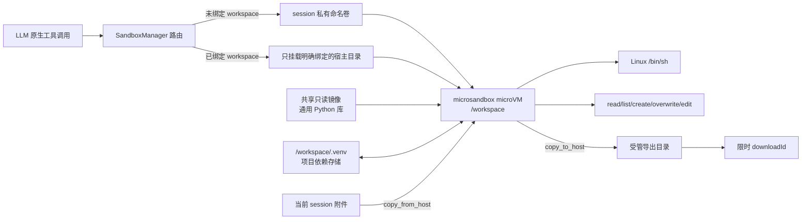

# microsandbox 接入架构

## 目标

这层接入同时解决两个问题：

1. 没有设置 workspace 时，原生 Agent 仍能立即获得可写、可执行的工作目录；
2. 执行不可信命令时，边界由 microVM 提供，而不再只依赖路径字符串检查。

## 会话数据流

每个 SJTUClaw session 最多拥有一个运行中的 microVM。Shell 与结构化文件工具
复用同一实例，因此 `run_command` 生成的文件能立即被 `read_file` 和
`create_download` 看见。异步 microsandbox SDK 固定运行在专用事件循环线程上，
同步 Tool handler 通过线程安全 Future 调用，避免跨事件循环复用 SDK 对象。

Python 依赖分为两层：

- 基础镜像预装多数 session 共享的通用库，镜像构建时执行 `pip check` 和导入
  检查；镜像作为只读 OCI lower layer 被所有 microVM 复用。
- 每个 microVM 在 Linux rootfs 创建 `/opt/sjtuclaw/project-venv`，使用
  `--system-site-packages` 读取镜像通用库。Shell 默认注入 `VIRTUAL_ENV` 和
  PATH，因此普通 `pip install` 与 `python -m pip install` 会立即安装到可执行的
  运行环境。
- 为兼容 microsandbox 0.6.7 Windows passthrough 对只读 FUSE handle 执行
  `sync_data()` 时产生的 EACCES，启动时由同步器把 `/workspace/.venv` 中的项目包
  和 console scripts 恢复到运行 venv；每条 Shell 命令结束后再保存回去。同步器
  只忽略“数据已读完、关闭只读句柄时”的 EACCES，其他 I/O 错误仍会失败。

`/workspace/.venv` 使用带版本标记的 SJTUClaw 持久存储布局；已有但未受管理的
同名目录不会被静默覆盖。初始化失败时新 microVM 会停止，错误返回给调用方。
需要使用 Alpine 等无 Python 镜像时，可显式设置
`SANDBOX_PROJECT_VENV=false`。

`/workspace/.venv` 与 workspace 同生命周期，而不是与当前 microVM 同生命周期：
私有 workspace 下每个 session 各有一份，宿主挂载下则由绑定目录决定。两个
session 若绑定同一个物理目录，会看到同一份项目依赖；应避免同时对同一目录执行
`pip install` 或卸载操作。`/sandbox off` 只停止 microVM，不删除依赖存储。

通用镜像由 `packaging/sandbox/Dockerfile` 和
`requirements-common.txt` 定义。Windows 构建脚本先通过 Docker 构建，再执行
`docker save` 和 `msb load`，因为 microsandbox 使用自己的 OCI 缓存，不能直接
读取 Docker Desktop 的本地镜像仓库。更新通用依赖后必须重新构建、导入，并重启
相关 microVM。

Shell 输出通过 SDK 事件流持续排空，不会先在宿主内存中拼接完整结果。SJTUClaw
只保留每个输出流的有界头部及用于解析 cwd 标记的少量尾部；Tool 返回最多
64 KiB。stdout 与 stderr 合计超过 8 MiB 时会终止 guest 进程并返回明确错误，
避免无限输出同时压垮 SDK 队列或宿主进程。输出按字节收集，展示时使用 UTF-8
容错解码，因此任意二进制输出不会触发 SDK 的文本解码异常。

## 路径与挂载边界

- guest 工作区固定为 `/workspace`。
- 相对结构化路径相对于 `/workspace` 解析。
- `../`、`/etc/...`、Windows 盘符路径和 UNC 路径不会被结构化文件工具接受。
- Shell 是 microVM 内的完整 Linux 环境，可以访问 guest `/tmp`、`/etc` 等路径；
  这些路径不是宿主同名路径。
- 绑定宿主 workspace 时启用 `nosuid` 和 `nodev`。挂载兼容策略默认 `auto`：
  Windows 使用 `relaxed` stat virtualization 与 `mirror` 普通 rwx 位传播，避免
  NTFS 挂载中 guest 新文件出现 ELOOP/EACCES、不可重新执行及 POSIX 符号链接
  失败；其他宿主使用 `strict` 与 `private`。可通过配置显式覆盖 stat 策略。
- 未绑定时使用确定性的 session 命名卷；正常退出只停止 microVM，删除 session
  时才删除该卷。
- 文件读取使用流式 API，在达到 Tool 的字节上限后停止读取。覆盖、编辑和附件
  导入先写入目标同目录的随机临时文件，再通过 rename 提交；写入失败时旧文件
  保持不变。

## 故障策略

`off`、`auto` 与 `required` 决定新 session 的默认开关状态；未显式配置时使用
`off`，因此新 session 默认关闭。显式设置 `auto` 会在 SDK 可发现时选择
sandbox，`required` 始终选择 sandbox。除
`required` 外，用户可以使用 `/sandbox on` 与 `/sandbox off` 覆盖当前 session
的默认值；覆盖状态写入 Session metadata，不会影响其他会话，应用重启后继续
生效。新建和 fork session 不复制该状态；删除 session 时随主记录删除。某次操作
一旦被路由到 sandbox，创建或执行失败都会直接返回结构化错误，不在同一次调用中
重试宿主执行。显式开启的 session 即使不处于 `required` 全局模式，在 sandbox
运行环境不可用时也会 fail-closed；只有未显式设置、由 `auto` 配置默认选中的
session 才允许在能力探测失败时保持旧宿主路径。

`/sandbox` 本身只显示 `on`、`off`、`status` 的简要说明；不会隐式查询或改变
状态。Gateway 将当前有效状态写入 session API 和 SSE，Web UI 据此只在已生效的
session 上显示 Sandbox 图标。

停止 microVM 或删除私有卷失败也会向调用方传播。交互式关闭、workspace 变更
和后端切换只有在清理成功后才报告成功；应用退出阶段无法再重试的清理错误会
写入日志。

当前 microVM 覆盖 SJTUClaw 原生 ToolRegistry。Pi 与 Claude Code 拥有自己的
进程和原生工具循环，尚不能仅靠宿主工具桥获得同等隔离，因此
`required` 模式拒绝切换这两个后端。后续要覆盖它们，应把 agent 进程本身及其
RPC/MCP 通道移入 microVM，而不是只修改启动 cwd。

## 测试边界

单元测试使用同步内存后端验证：

- 无 workspace 自动创建私有卷；
- 文件、Shell 和导出共享同一 session 文件系统；
- workspace 绑定变化会停止旧 microVM 并按新挂载重建；
- 结构化路径不能逃出 `/workspace`；
- `required` 在 SDK 缺失或 UNLIMITED 下 fail-closed；
- session 删除会停止 microVM 并移除私有卷。
- 项目依赖同步、默认 Shell 环境、microVM 重启恢复和失败回收；
- session 开关隔离、Web UI 状态投影和新 session 默认关闭；
- 显式状态跨进程重启恢复、fork 不继承及不可用时 fail-closed；
- Shell/文件读取有界、非 UTF-8 输出可容错展示；
- 覆盖与附件导入原子提交，失败不破坏旧文件；
- 停止或 volume 删除失败会被报告且保留可重试状态。

真实 microVM 冒烟测试还依赖宿主已安装 microsandbox wheel、启用虚拟化并可取得
所配置 OCI 镜像，因此不应混入不具备这些条件的默认单元测试。
