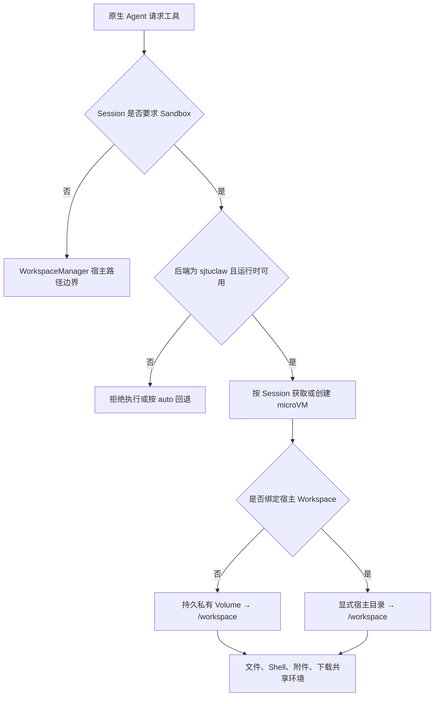

# microsandbox 接入架构

SJTUClaw 可以把原生 Agent 的文件、Shell、附件复制和文件交付路由到 Session 级 microsandbox microVM。目标是让同一 Session 的操作共享状态，同时把结构化文件访问限制在 `/workspace`。

## 生效条件

Sandbox 只覆盖 `sjtuclaw` 原生 Agent 后端，不覆盖 Pi 或 Claude Code 的原生工具。

```text
SANDBOX_MODE=off       默认关闭；可用 /sandbox on 单独开启
SANDBOX_MODE=auto      新 Session 默认尝试使用；不可用时保留宿主行为
SANDBOX_MODE=required  强制使用；任何不满足条件的情况均拒绝执行
```

显式 `/sandbox on` 和 `required` 都采用 fail-closed：SDK、`msb`、镜像或虚拟化不可用时不会静默回退宿主。

Sandbox 与 UNLIMITED 不兼容。`required` 模式不能关闭 Sandbox，也不能切换到 Pi / Claude Code。

## 路由流程



microVM 按需创建，不是在 Session 建立时立即启动。同一进程内，一个 Session 对应一个长生命周期 microVM；不同 Session 使用不同名称、锁和持久 Volume。

## Workspace 类型

### 私有 Workspace

Session 未绑定宿主目录时，Sandbox 使用确定性的私有 Volume，并挂载到 `/workspace`。停止或重建 microVM 不删除该 Volume。

这允许用户在不开放任何宿主目录的情况下使用文件与 Shell 工具。

### 宿主绑定

设置 `/workspace set <目录>` 后，只把该明确目录映射到 guest `/workspace`。

- 结构化文件工具只接受 `/workspace` 内路径。
- Windows 盘符、UNC 路径和越界 `..` 会被拒绝。
- Shell 可以访问 microVM 内其他 Linux 路径，但不能借此读取未挂载的宿主目录。

Workspace 绑定变化时，旧 microVM 会停止，并按新挂载重新创建。

## 工具适配

| 工具类别 | Sandbox 行为 |
| --- | --- |
| `list_dir`、`read_file` | 通过 microsandbox 文件接口读取 |
| `create_file`、`overwrite_file`、`edit_file` | 在 guest `/workspace` 内写入 |
| `new_shell`、`run_command` | 使用 microVM `/bin/sh`，保留 Session 当前目录 |
| `copy_attachment_to_workspace` | 把宿主附件复制到 guest |
| `create_download` | 把 guest 文件导出到 `data/sandbox/exports/` 后注册 |
| `web_search`、`web_fetch` | 仍由宿主工具执行，不路由 microVM |
| Memory、Skill、Cron | 仍使用 SJTUClaw 宿主服务 |

AUTO 只有在 Sandbox 实际生效时才会自动批准 microVM 内 Shell；宿主 Shell 仍需审批。

## 项目 Python 环境

开启 `SANDBOX_PROJECT_VENV=true` 后，SJTUClaw 提供两层环境：

```text
/opt/sjtuclaw/runtime-venv   microVM 本地可执行 venv
/workspace/.venv            持久化的项目包和 console scripts
```

启动 microVM 时：

1. 在 Linux rootfs 创建带 `--system-site-packages` 的运行 venv。
2. 从 `/workspace/.venv` 恢复项目包和脚本。
3. 把 `python`、`pip` 和 console scripts 指向运行 venv。

每次 Shell 命令结束后，再把新增或更新的项目包同步回 `/workspace/.venv`。这样既能读取镜像中的通用库，又能在 microVM 重建后保留 `pip install` 的项目依赖。

如果 `/workspace/.venv` 已存在但不是 SJTUClaw 管理的 `sync-v1` 布局，系统会拒绝覆盖。

## 资源与网络

核心配置：

```env
SANDBOX_CPUS=2
SANDBOX_MEMORY_MIB=2048
SANDBOX_MAX_DURATION_S=21600
SANDBOX_IDLE_TIMEOUT_S=3600
SANDBOX_NETWORK=public
SANDBOX_SECURITY=restricted
SANDBOX_WORKSPACE_QUOTA_MIB=4096
```

- `SANDBOX_NETWORK=none` 关闭 guest 网络。
- `restricted` 是推荐安全级别。
- 写入配额限制私有 Volume 或已绑定 Workspace 中新增的数据量。
- `SANDBOX_STAT_VIRTUALIZATION=auto` 在 Windows 使用兼容的 stat 虚拟化策略，其他平台偏向严格策略。

## 生命周期与故障策略

- `/sandbox on`：检查后端、UNLIMITED、SDK 和运行时后保存 Session 偏好。
- 首次工具调用：创建 microVM、挂载 Workspace、初始化项目环境。
- `/sandbox off`：先停止 microVM，再保存关闭状态；私有 Volume 保留。
- 应用关闭：停止当前进程拥有的 microVM。
- Session 删除：清理对应运行实例；持久资源按实现的删除流程处理。

关键故障采用安全默认值：

- 显式开启或 `required` 时，运行环境错误直接返回用户，不回退宿主。
- 旧 microVM 停止失败时，不创建替代环境。
- 项目 venv 初始化失败时，停止刚创建的 microVM。
- 下载必须先导出到受管目录，不能把任意 guest 路径暴露给 Gateway。

## Windows 前置条件

- Windows Hypervisor Platform 已启用。
- 安装 `microsandbox>=0.6.7,<0.7`。
- `msb doctor` 可以成功运行。
- 所用镜像已经由 `msb load` 导入。

推荐构建项目镜像：

```powershell
.\packaging\sandbox\Build-SandboxImage.ps1
```

镜像构建和真实环境验证见 [Sandbox 基础镜像](../packaging/sandbox/README.md)。

## 关键实现

- `claw/sandbox/config.py`：配置解析与校验。
- `claw/sandbox/runtime.py`：Session 生命周期、挂载、文件和 Shell 适配。
- `claw/sandbox/project_env_sync.py`：项目依赖恢复与持久化。
- `claw/workspace/manager.py`：宿主 Workspace 绑定和路径检查。
- `claw/tools/`：各工具的宿主 / Sandbox 双路由。
