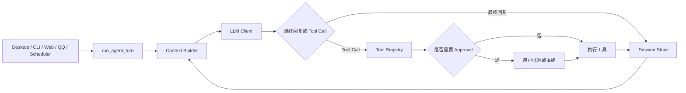

# SJTUClaw 项目中期报告

## 一、项目概述

SJTUClaw 是一个面向个人使用与课程教学场景的本地 AI Agent Runtime。项目以大语言模型为推理核心，在其外部实现会话持久化、上下文管理、长期记忆、工具调用、权限审批、任务调度、Skill 扩展和多渠道交互，使模型能够从“单轮问答程序”逐步发展为可以持续理解上下文、操作真实环境并完成复杂任务的个人智能助手。

截至目前，项目已经完成 `SJTUClaw.md` 中 Step 0 至 Step 9 的主要要求，并进一步实现了 Web UI、Windows 桌面应用、QQ Bot、桌面宠物、Memory Reflection、Heartbeat、Agent 运行指标与安全加固等扩展功能。当前 Python 自动化测试共 326 项，全部通过；Windows 桌面程序也已完成 PyInstaller 构建、Inno Setup 7 安装包生成和本地 Gateway 冒烟测试。项目主体功能已经形成闭环，现阶段工作重点正从“功能实现”转向“稳定性、智能性、易用性与生态扩展”。

## 二、当前已实现功能

### 2.1 按课程 Step 列出的实现进度

| Step | 当前实现情况 |
| --- | --- |
| **Step 0：环境准备与 LLM API 接入** | 已实现从 `.env`、系统环境变量和运行时设置中读取模型配置；提供 OpenAI Compatible API 客户端，支持自定义 `base_url`、模型名、上下文窗口等参数；实现请求超时、指数退避重试、异常分类和敏感信息脱敏。通过兼容接口可以接入 OpenAI、Ollama、vLLM、LM Studio 等服务。 |
| **Step 1：多轮对话 Loop** | 已实现 CLI REPL 和持续多轮对话。核心逻辑被统一封装在 `run_agent_turn()` 中，负责保存用户消息、构造上下文、调用模型、执行工具、写回观察结果并生成最终回复，CLI 本身只负责输入输出和命令分发。 |
| **Step 2：多 Session 管理与持久化** | 支持创建、列出、切换、重命名、删除和恢复 Session，不同 Session 的消息相互隔离。会话使用 JSONL 文件持久化，并实现原子替换、损坏文件隔离、旧格式迁移、运行检查点恢复、未完成用户轮次恢复、Session 分叉和自动标题。 |
| **Step 3：System Prompt、Memory 与 Soul** | System Prompt、Identity、Soul、Tool Contract 分别保存在独立文件中，并由 Context Builder 统一加载。Memory 支持分类、标签、重要度、来源 Session、增删改查和跨 Session 检索；模型也可以通过 `remember`、`recall` 工具主动管理长期记忆。 |
| **Step 4：长对话 Compact** | 已实现基于消息 Token 数和上下文预算的会话压缩，将较早消息归纳为增量 Summary，同时保留最近的合法对话后缀。压缩失败时不会删除原消息；此外还实现了空闲 Session 后台压缩、工具结果截断、超长上下文临时压缩和消息结构修复。 |
| **Step 5：Tool 与 Agent Loop** | 已实现原生 Function Calling 与 JSON 协议兼容解析，形成“模型思考—请求工具—Runtime 执行—结果回写—模型继续推理”的完整闭环。基础工具包括获取时间、列目录、读取文件，扩展工具包括网页搜索、网页读取、Memory、Cron、Skill、文件修改、Shell、附件和下载等。 |
| **Step 6：Gateway 与图形化入口** | 已实现基于 FastAPI 的 Gateway、REST API、SSE 事件流和 React Web UI。图形化入口支持发送消息、查看历史、管理 Session、查看错误、上传附件、设置 Workspace、处理 Approval、管理 Memory、Cron、Skill、模型配置和桌宠设置。 |
| **Step 7：Scheduler** | 支持一次性任务、固定间隔任务和 Cron 表达式任务，任务可以绑定原 Session，并复用统一 Agent Loop。系统保存任务状态、下次运行时间、执行历史、输出文件和失败原因，同时支持重复次数、任务依赖、暂停、恢复、删除及 Heartbeat 存活信息。 |
| **Step 8：Workspace、Advanced Tool 与 Approval** | 支持按 Session 绑定 Workspace；实现创建、覆盖、局部编辑文件，启动持久 Shell、执行命令、复制附件、创建下载入口等高级工具。写文件与 Shell 操作需要通过 Approval，路径解析、命令执行和附件访问均受到 Workspace 边界限制。 |
| **Step 9：Skill System** | 已实现 Skill 扫描、YAML Frontmatter 解析、轻量索引、按需加载、显式调用和模型自动选择。现有 `course-report`、`material-summary`、`presentation-outline` 三个 Skill；同时支持依赖检查、安装与删除、热重载、使用统计、生命周期状态和 Skill 文件管理。 |

### 2.2 课程要求之外的扩展功能

- 实现 Windows 桌面应用，使用 pywebview 将 Gateway 托管的完整 Web UI 封装为独立窗口，并通过 PyInstaller 打包 Python 后端、前端静态资源、桌面宠物和运行依赖。
- 使用 Inno Setup 7 生成标准 Windows 安装向导，支持自选安装路径、开始菜单和桌面快捷方式、猫猫项目图标、覆盖升级以及系统卸载入口；安装版无需用户另行安装 Python 或 Node.js。
- 区分源码版与安装版的运行路径：源码版继续使用项目目录中的 `data/`，安装版将会话、Memory、设置、Cron、用户 Skill 和宠物资源保存到 `%APPDATA%\SJTUClaw\data`，避免写入受保护的安装目录。
- 实现 QQ Bot 渠道，支持私聊、群聊、消息去重、断线重连、心跳保活、图片和文件发送，以及通过交互按钮完成工具审批。
- 实现桌面宠物模块，能够显示 Agent 的空闲、思考、工具执行和等待审批等状态，并支持宠物资源安装、切换和位置保存。
- 实现每日 Reflection，从近期 Session 中提炼值得长期保存的事实，并写入 Memory Store。
- 实现 Heartbeat 机制，周期性检查用户在 `HEARTBEAT.md` 中记录的长期任务。
- 实现 Agent 运行指标和健康监控，记录迭代次数、LLM 调用、工具调用、失败情况和延迟，并检测异常循环或运行退化。
- 实现运行时模型与渠道配置，敏感配置在本地加密保存，Web UI 无需直接接触明文 API Key。

## 三、项目结构与模块划分

### 3.1 总体结构

```text
SJTUClaw/
├── claw/
│   ├── agent/          # 统一 Agent Loop、事件、预算、指标与健康监控
│   ├── approval/       # 高风险工具审批和等待机制
│   ├── channels/       # 外部消息渠道，目前包含 QQ Bot
│   ├── cli/            # CLI 入口、REPL 和内部命令
│   ├── context/        # Context Builder、Token 预算与 Compact
│   ├── gateway/        # FastAPI Gateway、REST API、SSE、附件服务
│   ├── llm/            # LLM 客户端和工具调用协议解析
│   ├── memory/         # 长期记忆存储、检索和 Reflection
│   ├── pet/            # 桌面宠物进程、状态与资源管理
│   ├── prompts/        # Prompt 模板加载
│   ├── scheduler/      # Cron、Heartbeat、任务分发与持久化
│   ├── session/        # Message、Session 模型及 JSONL Store
│   ├── skills/         # Skill Registry、管理和使用统计
│   ├── tools/          # 只读工具、高级工具及 Tool Registry
│   ├── desktop.py      # Windows 桌面窗口与本地 Gateway 启动器
│   ├── paths.py        # 源码版、冻结版资源路径和用户数据路径
│   └── workspace/      # Workspace 绑定、路径解析和边界检查
├── prompts/            # Identity、System Prompt、Soul、Tool Contract
├── skills/             # 本地 Skill 数据目录
├── webui/              # React + TypeScript + Vite 前端源码
├── web/                # 已构建的 Web UI 静态文件
├── packaging/windows/  # PyInstaller Spec、Inno Setup 脚本、构建脚本和图标
├── tests/              # 后端与前端测试
├── data/               # Session、Memory、Cron、Workspace 等运行数据
├── docs/               # 配置、测试和使用文档
├── pyproject.toml      # Python 包配置和 sjtuclaw 命令入口
└── .env.example        # 环境变量示例
```

### 3.2 模块职责

项目采用“入口层—运行时层—能力层—存储层”的划分方式：

1. **入口层**：Windows 桌面应用、CLI、Web UI、REST API、QQ Bot 和 Scheduler 接收不同来源的请求，但不直接调用 LLM，而是将请求转换为统一的 Agent Turn。桌面应用负责启动本地 Gateway，并通过 pywebview 展示同一套 Web UI。
2. **运行时层**：`agent/loop.py` 是核心调度器，统一管理模型调用、工具调用、审批、循环控制、取消、失败恢复和最终回复。
3. **上下文层**：`context/` 负责把 Identity、System Prompt、Soul、Memory 索引、Skill 索引、Session Summary 和近期消息组织为模型输入。
4. **能力层**：`tools/`、`skills/`、`scheduler/`、`memory/` 为 Agent 提供环境操作、专业工作流、定时执行和长期知识。
5. **安全层**：`workspace/`、`approval/` 以及 Tool Guardrails 共同限制文件路径、Shell、网络访问和工具循环。
6. **存储层**：Session 使用 JSONL，Memory 使用 Markdown 与 YAML Frontmatter，Cron 和 Workspace 绑定使用 JSON，使运行数据可读、可迁移、便于调试。

统一调用链如下：



## 四、核心数据结构

| 数据结构 | 主要字段 | 作用 |
| --- | --- | --- |
| `Message` | `role`、`content`、`tool_calls`、`tool_call_id`、`name`、`timestamp`、`media` | 表示会话中的一条消息，同时支持原生工具调用、工具观察结果、附件和内部事件。 |
| `Session` | `session_id`、`title`、`messages`、`summary`、`last_consolidated`、`skill_usage`、`metadata` | 表示一个独立会话。`summary` 保存压缩摘要，`last_consolidated` 标记已归档消息边界，`metadata` 保存运行检查点、目标状态和标题信息。 |
| `MemoryEntry` | `memory_id`、`content`、`category`、`tags`、`importance`、`source_session_id`、时间和召回信息 | 表示跨 Session 的长期记忆，以分类 Markdown 文件保存，兼顾机器检索和人工维护。 |
| `Tool` | `name`、`description`、`input_schema`、`handler`、`safety_level`、`concurrency_safe` | 描述一个可被模型调用的工具。JSON Schema 用于参数校验，安全等级决定是否进入审批流程。 |
| `ToolResult` | `ok`、`content`、`error` | 统一工具成功与失败的返回格式，结果会写回 Session，成为模型下一轮推理的 Observation。 |
| `ApprovalRequest` | `approval_id`、`session_id`、`tool_name`、`tool_args`、`status`、`reject_reason` | 表示一次待确认操作，支持批准、拒绝、超时和按 Session 查询。 |
| `CronJob` | `id`、`schedule`、`payload`、`state`、`repeat_times`、`repeat_completed` | 表示定时任务；Schedule 支持 `at`、`every`、`cron`，State 保存下次触发、执行历史、错误、暂停和运行声明。 |
| `SkillInfo` | `name`、`description`、`instructions`、`assets`、`references`、依赖和可用状态 | 表示一个可复用工作流。模型平时只看到轻量索引，选中后才加载完整指令和资源。 |
| `RequestContext` | Session、Channel、Chat ID、Sender 等运行信息 | 将当前请求来源绑定到工具，使同一 Tool Registry 能够服务 CLI、Web 和 QQ 等不同入口。 |

## 五、项目功能特色

### 5.1 统一 Agent Runtime

项目最重要的设计原则是“所有入口复用同一套 Runtime”。CLI、Gateway、QQ、Cron、Heartbeat 和 Reflection 不各自实现一套模型调用逻辑，而是尽量复用 Session Store、Context Builder、Memory、Compaction、Tool Registry 和 Agent Loop。这样可以保证不同入口拥有一致的上下文、权限和工具行为，也降低后续增加新渠道时的维护成本。

Agent Loop 不是简单的单次 API 调用，而是一个受控的 Think-Act-Observe 循环。系统设置最大迭代次数、单轮工具调用次数、相同工具调用次数和重复拒绝次数；支持用户取消、模型异常恢复、工具执行简报、运行指标与健康告警，从而防止模型陷入无休止的工具循环。

### 5.2 分层 Memory 架构

Memory 系统将“当前对话历史”和“跨会话长期知识”分离。Session 只保存某个主题下的交流过程，Memory 则保存用户偏好、项目背景、事实和决策等长期信息。

Memory 采用“文件即数据库”的设计：每条记忆是带 YAML Frontmatter 的 Markdown 文件，并按类别组织。其优点是内容透明、方便人工查看和修正、易于备份与迁移，也可以在不依赖数据库服务的情况下运行。Context Builder 不会把全部记忆直接塞入 Prompt，而只加入统计信息和近期预览；当模型需要回答用户背景、项目历史或偏好时，再通过 `recall` 工具按需检索，减少上下文占用。

在此基础上，项目实现了 Reflection：系统可以定期回顾近期会话，抽取值得长期保存的事实并写入 Memory。这使 Memory 从完全依赖手动维护，逐步发展为“用户主动保存 + Agent 主动发现”的混合架构。

### 5.3 三层 Compact 设计

项目的 Compact 并不是单一的“把旧消息总结一下”，而是由三层机制共同构成：

1. **持久化会话摘要**：达到阈值后，将早期消息压缩成增量 Summary，更新 `last_consolidated`，保留最近若干轮原始消息。
2. **空闲 Session 后台压缩**：由 Compaction Worker 在会话长时间空闲后处理历史，避免每轮对话都因压缩增加等待时间。
3. **模型调用前 Context Governance**：发送前在内存副本上修复孤立 Tool Result、补齐中断的 Tool Call、截断超长工具结果、微压缩本轮大输出，并在仍超出预算时从前部裁剪历史。

System Prompt、Soul、Memory 和 Skill 索引属于稳定上下文，不会被普通 Session Compact 覆盖；Summary 也通过明确的边界提示告诉模型“这是过去任务的交接信息，而不是当前指令”，降低摘要被误执行的风险。

### 5.4 可扩展 Tool 系统

Tool Registry 统一保存工具名称、描述、JSON Schema、执行函数、安全等级、并发属性和输出上限。模型既可以使用原生 Function Calling，也可以通过兼容协议表达工具请求。Runtime 会在执行前完成参数校验和边界检查，在执行后把结果重新写入 Session，让模型基于真实 Observation 继续推理，而不是假设操作已经完成。

工具系统还具有以下安全与稳定性设计：

- 只读、写入、Shell、下载、Skill 选择等不同安全等级。
- Workspace 路径解析与目录穿越防护。
- 网页工具的私网地址和 SSRF 防护。
- 写操作与 Shell 操作的显式 Approval。
- 无审批通道时默认拒绝高风险操作，即“fail closed”。
- 单轮调用次数、相同调用和无进展循环检测。
- 工具返回值自动截断和结构化错误包装。
- 正常完成任务时直接返回最终答复，不额外发送执行简报；模型异常、空回复、输出截断、循环终止或用户取消时生成失败/部分完成简报，并保留已完成的工具结果。
- 原生 Function Calling 消息完整保存 `tool_calls`、`tool_call_id` 和工具名称，并对旧会话中的孤立 Tool Result 做兼容修复。
- 文件读取状态记录，减少基于过期内容进行覆盖的风险。

### 5.5 渐进式 Skill 系统

Skill 用于保存某类任务的稳定工作方法，而不是把所有专业流程写进 System Prompt。系统平时只向模型提供 Skill 名称、描述和路径，只有在用户显式调用或模型选择并经过确认后，才加载完整 `SKILL.md`、模板和参考资料。这种渐进式加载方式既降低了 Token 消耗，也避免无关 Skill 干扰当前任务。

当前 Skill Registry 已支持依赖检查、错误隔离、分类目录、热重载、安装与删除、使用次数统计、过期状态和归档状态，为后续形成可共享的 Skill 生态奠定了基础。

### 5.6 多入口与低耦合交互

Windows 桌面应用、Web UI、QQ Bot、CLI 和桌面宠物分别面向不同使用场景：

- Windows 桌面应用适合普通用户日常使用，启动后自动运行本地 Gateway，并在独立窗口中加载完整 Web UI。
- CLI 适合开发、调试和快速操作。
- Web UI 提供完整的会话、附件、设置、Memory、Cron、Skill 和审批界面。
- QQ Bot 允许用户通过常用消息软件远程调用 Agent。
- 桌面宠物将后台运行状态可视化，降低 Agent 的“黑盒感”。

桌面版没有复制一套独立后端，而是复用 Gateway、Web UI 和统一 Agent Runtime。`desktop.py` 负责选择可用端口、启动 Uvicorn、等待服务就绪并创建 pywebview 窗口；`paths.py` 负责区分源码目录、PyInstaller 资源目录和用户可写目录。安装版将运行数据保存到 `%APPDATA%\SJTUClaw\data`，因此应用可以安装到 `Program Files` 等受保护目录，也不会在覆盖升级时破坏用户数据。

各入口只负责消息传输、进程启动和界面呈现，核心智能逻辑仍由 Runtime 统一完成，因此未来增加飞书、微信、Telegram 或邮件渠道时，不需要重新实现 Agent。

## 六、当前未完成或仍需完善的部分

虽然课程要求的主要功能已经具备，但项目距离稳定、易用的个人 Agent 产品仍有以下不足：

1. **LLM 调用渠道仍较单一。** 当前主要依赖 OpenAI Compatible Chat Completions 接口，不同厂商在流式输出、工具调用、推理内容、多模态和错误格式上的差异尚未被抽象为独立 Provider。
2. **Memory 召回仍以规则和词法匹配为主。** 面对同义表达、隐含关联和大量长期记忆时，召回准确率仍有提升空间；记忆冲突、过期、合并、遗忘和隐私分级也需要更系统的策略。
3. **Reflection 仍是初步的自动记忆机制。** 它主要负责抽取事实，尚未充分评估事实可信度、来源、冲突关系和后续价值，也没有形成更完整的知识关联图。
4. **Compact 策略仍需持续优化。** 当前摘要质量依赖模型，极长会话中可能出现细节丢失；不同类型内容，如代码、任务状态、工具结果和用户偏好，未来需要采用不同压缩策略。
5. **Agent Loop 的复杂任务能力仍可增强。** 当前以单 Agent 循环为主，虽然已有预算、取消和健康监控，但复杂任务的显式计划、阶段检查点、失败重试、暂停恢复和子任务并行仍不完整。
6. **Approval 主要是进程内状态。** 服务重启后，待审批请求不能完整恢复；未来需要持久化审批状态，并进一步支持操作预览、差异展示和细粒度权限策略。
7. **桌面端的产品化能力仍需完善。** 当前已经具备独立窗口、标准安装向导、快捷方式、覆盖升级和卸载能力，但尚未实现代码签名、自动更新、系统托盘、开机启动、崩溃反馈和图形化日志诊断；安装包目前也主要面向 64 位 Windows。
8. **消息渠道数量有限。** 当前主要实现 CLI、Web 和 QQ，尚未覆盖飞书、微信、Telegram、Discord、邮件等常见渠道。
9. **前端工程和端到端测试仍需补强。** 前端已有组件测试，但还需要更完整的浏览器级测试，覆盖流式消息、附件、审批、Cron 和异常恢复。
10. **可观测性和运维能力仍不充分。** 当前已有基础 Metrics 和 Health Monitor，但还缺少统一日志检索、调用链追踪、Token 与费用统计、任务看板和故障诊断界面。

## 七、后续开发计划

### 7.1 扩展 LLM Provider 与多模态能力

后续将把 LLM Client 抽象为 Provider 接口，为 OpenAI、Anthropic、Gemini、DeepSeek、OpenRouter、本地 Ollama/vLLM 等渠道提供独立适配器；统一处理流式输出、工具调用、上下文窗口、重试、限流和错误映射。同时增加图片、PDF、音频等多模态输入，使附件不只作为文件保存，还能进入模型理解流程。

### 7.2 全面优化现有核心系统

- **Memory**：增加向量检索、关键词与语义混合召回、时间衰减、重要度重排、冲突检测、来源追踪、合并与遗忘机制。
- **Compact**：对普通对话、代码修改、任务状态和工具日志采用不同摘要模板；增加摘要质量检查、关键事实保留和可回溯归档。
- **Loop**：增加显式任务计划、阶段目标、检查点、自动重试、失败降级、暂停与恢复，并探索受控的多 Agent 或子任务并行。
- **Tool**：完善并行执行、幂等性、超时与取消；为文件修改增加 Diff Preview 和事务式回滚；为 Shell 增加更细粒度的命令策略。
- **Scheduler**：增加错过任务补偿、失败重试、并发限制、任务优先级、通知策略和更清晰的任务依赖可视化。
- **Skill**：增加 Skill 市场、签名校验、版本管理、沙箱安装、共享与评分机制。

### 7.3 持续完善桌面端软件

当前已经使用 pywebview、PyInstaller 和 Inno Setup 7 完成 Windows 桌面端第一阶段建设，实现一键安装、自选安装路径、开始菜单、桌面快捷方式、独立应用窗口、覆盖升级和卸载，用户无需手动安装 Python、Node.js 或执行启动命令。

后续将在现有方案上增加首次启动配置向导、Workspace 选择、系统托盘、开机启动、应用内日志查看、崩溃报告、数字签名和自动更新。同时继续评估 pywebview 与 Tauri 等方案在安装包体积、WebView2 兼容性、进程管理和跨平台支持方面的差异，再决定是否需要迁移桌面壳。

### 7.4 扩展消息渠道

在现有 `BaseChannel` 抽象上继续增加飞书、企业微信、微信公众号、Telegram、Discord、Slack、邮件等渠道，并统一消息、附件、引用、线程、审批按钮和主动通知的接口。还将增加身份映射和权限控制，避免不同渠道用户错误共享 Session 或 Memory。

### 7.5 引入 Dream 机制

Dream 机制将建立在 Reflection、Memory、Scheduler 和 Heartbeat 之上，在系统空闲时进行更深层的离线整理。与只提取事实的 Reflection 不同，Dream 计划完成以下工作：

- 回顾近期会话、工具结果、定时任务和未完成目标。
- 发现相互矛盾、重复、过期或缺少来源的 Memory。
- 合并相关记忆，建立项目、人物、决策和任务之间的关联。
- 总结近期反复出现的失败模式，提出 Prompt、Tool 或 Skill 的改进建议。
- 发现被遗忘的待办事项，并形成“建议行动”，但在用户确认前不执行高风险操作。
- 生成每日或每周摘要，使用户能够查看 Agent 在后台整理出了哪些新认识。

该机制的目标不是让 Agent 在无人监督时任意行动，而是让它具备“离线反思—知识整理—提出建议—等待确认”的能力，在保持可控性的前提下提升长期使用价值。

### 7.6 加强测试、安全与可观测性

后续将补充跨平台测试、Gateway 与真实浏览器端到端测试、长会话压力测试、并发 Session 测试和故障注入测试；完善 Approval 持久化、敏感数据加密、审计日志、速率限制和渠道鉴权。同时建设可观测面板，展示 LLM 调用次数、Token 消耗、工具成功率、平均延迟、Compact 次数、Memory 命中率和 Cron 健康状态。

## 八、阶段总结

目前 SJTUClaw 已经完成从“最小 LLM 调用”到“多入口、可记忆、可调用工具、可定时执行、受审批控制、可通过 Skill 扩展并可作为 Windows 软件安装”的完整演进。项目的主要成果不仅是实现了若干功能，更重要的是建立了统一 Runtime、分层 Context、长期 Memory、三层 Compact、Tool Registry、安全 Approval 和统一运行路径管理等可持续扩展的架构。

下一阶段将以优化现有系统为主线，在此基础上扩展模型渠道和消息渠道，完善桌面端的签名、更新与系统集成功能，并探索 Dream、多模态和更强任务规划能力，使 SJTUClaw 从课程项目进一步发展为稳定、易用且具有长期个性化能力的个人 AI Agent。
