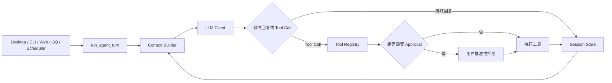

# SJTUClaw 项目中期报告

## 一、项目概述

SJTUClaw 是一个面向个人使用与课程教学场景的本地 AI Agent Runtime。项目以大语言模型为核心，补充会话持久化、上下文管理、长期记忆、工具调用、权限审批、任务调度、Skill 扩展和多渠道交互，使模型从“单轮问答程序”发展为可操作真实环境的个人智能助手。

目前项目已完成 `SJTUClaw.md` 中 Step 0 至 Step 9 的主要要求，并扩展了 Web UI、Windows 桌面应用、QQ Bot、桌面宠物、Reflection、Heartbeat、运行指标与安全加固。当前 Python 自动化测试 326 项全部通过；桌面程序已完成 PyInstaller 构建、Inno Setup 7 安装包生成和 Gateway 冒烟测试。

## 二、当前已实现功能

### 2.1 按课程 Step 列出的实现进度

| Step | 当前实现情况 |
| --- | --- |
| **Step 0：环境准备与 LLM API 接入** | 已支持模型配置读取、OpenAI Compatible 客户端、超时重试、异常分类和敏感信息脱敏，可接入 OpenAI、Ollama、vLLM、LM Studio 等服务。 |
| **Step 1：多轮对话 Loop** | 已实现 CLI REPL 和统一 `run_agent_turn()`。 |
| **Step 2：多 Session 管理与持久化** | 支持 Session 管理、自动标题、分叉和 JSONL 持久化。 |
| **Step 3：System Prompt、Memory 与 Soul** | Prompt 组件统一加载；Memory 支持分类、增删改查和 `remember` / `recall`。 |
| **Step 4：长对话 Compact** | 已实现增量 Summary、近期消息保留、后台压缩和结构修复。 |
| **Step 5：Tool 与 Agent Loop** | 已形成工具请求、执行、结果回写和继续推理闭环，覆盖文件、网页、Memory、Cron、Skill、Shell、附件和下载。 |
| **Step 6：Gateway 与图形化入口** | 已实现 FastAPI Gateway、REST API、SSE 和 React Web UI。 |
| **Step 7：Scheduler** | 支持一次性、固定间隔和 Cron 任务，并保存执行状态与历史。 |
| **Step 8：Workspace、Advanced Tool 与 Approval** | 支持 Workspace 绑定、文件写入、持久 Shell、附件复制和 Approval。 |
| **Step 9：Skill System** | 已实现 Skill 扫描、按需加载、显式调用、模型选择和生命周期管理。 |

### 2.2 课程要求之外的扩展功能

- Windows 桌面应用：用 pywebview 封装完整 Web UI，并通过 PyInstaller 打包后端、静态资源、桌宠和依赖。使用 Inno Setup 7 生成标准安装向导，支持自选路径、快捷方式、猫猫图标、覆盖升级和卸载。
- 运行路径隔离：源码版继续使用项目 `data/`，安装版将运行数据保存到 `%APPDATA%\SJTUClaw\data`。
- QQ Bot 与桌面宠物：支持消息入口、工具审批、状态可视化和宠物资源管理。
- Reflection、Heartbeat、运行指标和健康监控：用于长期记忆整理、长期任务检查和异常循环检测。
- 运行时模型与渠道配置：敏感配置本地加密保存，Web UI 不直接接触明文 API Key。

## 三、项目结构与模块划分

项目完整结构说明见项目源码中 [README.md 的“项目结构”章节](README.md#项目结构)，此处仅保留与本报告相关的简要概览。

### 3.1 总体结构

```text
SJTUClaw/
├── claw/               # Python Runtime 与多入口后端
├── prompts/            # Prompt 资源
├── skills/             # 内置 Skill
├── webui/              # React + TypeScript 前端源码
├── web/                # 已构建前端静态文件
├── packaging/windows/  # PyInstaller 与 Inno Setup 打包脚本
├── docs/               # 配置、测试与打包文档
├── tests/              # 自动化测试
├── data/               # 源码运行时数据
├── pyproject.toml      # Python 项目配置
└── README.md           # 使用说明与详细结构
```

### 3.2 模块职责

项目采用“入口层—运行时层—能力层—存储层”的划分方式：

1. **入口层**：桌面端、CLI、Web、QQ 和 Scheduler 统一汇入 Agent Turn。
2. **运行时层**：`agent/`、`context/`、`llm/` 负责推理循环、上下文构造与模型调用。
3. **能力层**：`tools/`、`skills/`、`memory/`、`scheduler/` 提供环境操作、工作流、长期记忆和定时任务。
4. **安全与存储层**：`approval/`、`workspace/` 负责边界控制；Session、Memory、Cron 等运行数据使用文件系统持久化。

统一调用链如下：



## 四、核心数据结构

| 数据结构 | 主要字段 | 作用 |
| --- | --- | --- |
| `Message` | `role`、`content`、`tool_calls`、`media` 等 | 表示会话消息，支持工具调用、观察结果和附件。 |
| `Session` | `session_id`、`title`、`messages`、`summary`、`metadata` 等 | 表示独立会话，保存消息、摘要和运行状态。 |
| `MemoryEntry` | `memory_id`、`content`、`category`、`tags`、`importance` 等 | 表示长期记忆，以 Markdown 保存。 |
| `Tool` | `name`、`description`、`input_schema`、`handler`、`safety_level` | 描述可调用工具及其审批策略。 |
| `ToolResult` | `ok`、`content`、`error` | 统一工具返回格式，并写回 Session。 |
| `ApprovalRequest` | `approval_id`、`session_id`、`tool_name`、`status` | 表示待确认操作。 |
| `CronJob` | `id`、`schedule`、`payload`、`state` | 表示定时任务。 |
| `SkillInfo` | `name`、`description`、`instructions`、`assets`、`references` | 表示可复用工作流。 |
| `RequestContext` | Session、Channel、Chat ID、Sender 等 | 绑定当前请求来源。 |

## 五、项目功能特色

### 5.1 统一 Agent Runtime

项目采用“所有入口复用同一套 Runtime”的设计。CLI、Gateway、QQ、Cron、Heartbeat 和 Reflection 共用 Session Store、Context Builder、Memory、Compaction、Tool Registry 与 Agent Loop，保证上下文、权限和工具行为一致。Agent Loop 支持迭代上限、工具上限、重复检测、用户取消和异常恢复。

### 5.2 分层 Memory 架构

Memory 将当前会话历史与跨会话长期知识分离：Session 保存交流过程，Memory 保存用户偏好、项目背景、事实和决策。长期记忆以 Markdown 文件保存；Context Builder 只注入统计信息和近期预览，需要时再通过 `recall` 检索。Reflection 会定期抽取值得保留的信息。

### 5.3 三层 Compact 设计

Compact 由三层机制构成：达到阈值后生成持久化摘要；会话空闲时后台压缩历史；模型调用前修复孤立 Tool Result、补齐中断 Tool Call、截断超长结果并裁剪超预算历史。System Prompt、Soul、Memory 和 Skill 索引作为稳定上下文，不会被普通 Session Compact 覆盖。

### 5.4 可扩展 Tool 系统

Tool Registry 统一管理工具描述、JSON Schema、执行函数、安全等级、并发属性和输出上限。模型可通过原生 Function Calling 或兼容协议请求工具；Runtime 执行前校验参数，执行后把结果写回 Session。

工具系统重点实现了：

- 安全等级、Workspace 路径、目录穿越、私网地址和 SSRF 防护。
- 写操作与 Shell 操作审批；无审批通道时默认拒绝高风险操作。
- 工具调用次数、重复调用和无进展循环检测，以及返回值截断。
- 任务成功时直接返回最终答复；异常时生成失败/部分完成简报。
- 完整保存 `tool_calls`、`tool_call_id` 和工具名称，并兼容修复孤立 Tool Result。

### 5.6 多入口与低耦合交互

Windows 桌面应用、Web UI、QQ Bot、CLI 和桌面宠物面向不同场景。桌面版复用 Gateway、Web UI 和统一 Agent Runtime；`desktop.py` 负责端口选择、服务启动和 pywebview 窗口创建，`paths.py` 区分源码、PyInstaller 资源和用户可写目录。安装版将运行数据保存到 `%APPDATA%\SJTUClaw\data`，支持覆盖升级时保留用户数据。各入口只负责消息传输、进程启动和界面呈现。

## 六、当前未完成或仍需完善的部分

虽然课程要求的主要功能已经具备，但项目距离稳定、易用的个人 Agent 产品仍有不足：

1. **模型与多模态能力有限。** 当前主要依赖 OpenAI Compatible Chat Completions 接口，不同厂商差异、多模态输入和错误格式仍需抽象为独立 Provider。
2. **Memory 与 Reflection 仍需增强。** 召回仍以规则和词法匹配为主，知识关联与可信度管理仍不完整。
3. **Compact 与复杂任务能力仍需优化。** 极长会话可能丢失细节，复杂任务的计划、检查点和恢复能力仍不足。
4. **渠道、测试和可观测性仍需补强。** 仍缺少更多消息渠道、浏览器级端到端测试、日志检索、费用统计和任务看板。

## 七、后续开发计划

### 7.1 扩展 LLM Provider 与多模态能力

后续将把 LLM Client 抽象为 Provider 接口，为 OpenAI、Anthropic、Gemini、DeepSeek、OpenRouter、本地 Ollama/vLLM 等渠道提供适配器，并统一处理流式输出、工具调用、上下文窗口、重试、限流和错误映射，同时增加图片、PDF、音频等多模态输入。

### 7.2 全面优化现有核心系统

- **Memory**：增加向量检索、混合召回、冲突检测与遗忘机制。
- **Compact / Loop**：优化摘要策略、关键事实保留、显式计划、检查点和自动重试。
- **Tool / Scheduler / Skill**：完善并行、幂等、超时取消、任务补偿和版本共享机制。

### 7.3 扩展消息渠道

在现有 `BaseChannel` 抽象上增加飞书、企业微信、Telegram、Discord、Slack、邮件等渠道，并统一消息、附件、引用、审批和通知接口，同时补充身份映射和权限控制。

### 7.4 引入 Dream 机制

Dream 机制将建立在 Reflection、Memory、Scheduler 和 Heartbeat 之上，在系统空闲时回顾会话、工具结果、定时任务和未完成目标，整理记忆冲突并总结失败模式，形成“离线反思—知识整理—提出建议—等待确认”的流程。

### 7.5 持续完善桌面端软件

当前已使用 pywebview、PyInstaller 和 Inno Setup 7 完成 Windows 桌面端第一阶段建设，支持一键安装、自选路径、快捷方式、独立窗口、覆盖升级和卸载。后续将增加首次启动配置、系统托盘、开机启动、日志查看、数字签名和自动更新，并继续评估 pywebview 与 Tauri 的差异。

### 7.6 加强测试、安全与可观测性

后续将补充跨平台、浏览器端到端、长会话压力、并发 Session 和故障注入测试；完善 Approval 持久化、敏感数据加密、审计日志、速率限制和渠道鉴权，同时建设可观测面板。

## 八、阶段总结

目前 SJTUClaw 已经完成从“最小 LLM 调用”到“多入口、可记忆、可调用工具、可定时执行、受审批控制、可通过 Skill 扩展并可作为 Windows 软件安装”的演进。项目的主要成果不仅是实现功能，更是建立了统一 Runtime、分层 Context、长期 Memory、三层 Compact、Tool Registry、安全 Approval 和统一路径管理等可扩展架构。

下一阶段将以优化现有系统为主线，扩展模型与消息渠道，完善桌面端签名、更新和系统集成，并探索 Dream、多模态和更强任务规划能力。
