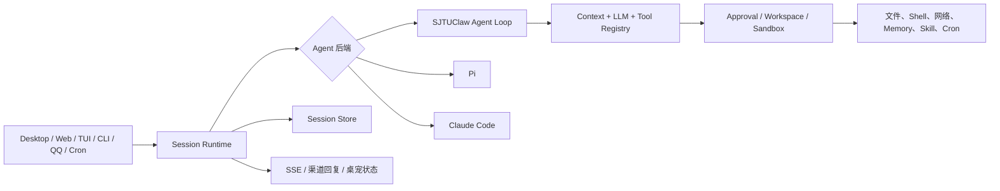

# SJTUClaw 项目中期报告

## 一、项目概述

SJTUClaw 是面向个人与教学场景的本地 AI Agent Runtime。项目在大语言模型之上提供会话持久化、上下文管理、长期记忆、工具调用、审批、任务调度、Skill 和多入口交互，使模型能够在明确安全边界内操作真实工作区。

当前版本为 `0.5.0`。项目已完成课程 Step 0–9 的主要目标，并扩展了 Web UI、TUI、Windows 桌面应用、QQ Bot、桌面宠物、Pi / Claude Code 后端、microsandbox、Workspace 回退和文件交付。

当前自动化测试可收集 741 项，基线为 `737 passed, 4 skipped, 2 subtests passed`；前端另有 Vitest 测试与 TypeScript 生产构建验证。

## 二、课程目标完成情况

| Step | 实现 |
| --- | --- |
| 0：环境与 LLM | OpenAI Compatible 配置、超时、重试、错误分类和密钥保护 |
| 1：多轮对话 | CLI REPL 与统一 Agent Turn |
| 2：多 Session | JSONL 持久化、自动标题、分叉和并发保护 |
| 3：Prompt 与 Memory | 分层 Prompt、Markdown 长期记忆、`remember` / `recall` |
| 4：Compact | 后台压缩、手动压缩、Token 预算和消息结构修复 |
| 5：Tool 与 Agent Loop | 原生 Function Calling、JSON 回退协议和工具闭环 |
| 6：Gateway 与 UI | FastAPI、REST、SSE、React Web UI、附件和文件下载 |
| 7：Scheduler | 一次性、间隔和 Cron 任务，Heartbeat 与运行记录 |
| 8：Workspace 与审批 | 路径边界、文件和 Shell 工具、Approval、回退和 Sandbox |
| 9：Skill | 扫描、按需加载、显式调用、管理和使用统计 |

## 三、系统结构

```mermaid
flowchart LR
    A["Desktop / Web / TUI / CLI / QQ / Cron"] --> B["Session Runtime"]
    B --> C{"Agent 后端"}
    C --> D["SJTUClaw Agent Loop"]
    C --> E["Pi"]
    C --> F["Claude Code"]
    D --> G["Context + LLM + Tool Registry"]
    G --> H["Approval / Workspace / Sandbox"]
    H --> I["文件、Shell、网络、Memory、Skill、Cron"]
    B --> J["Session Store"]
    B --> K["SSE / 渠道回复 / 桌宠状态"]
```

代码按职责划分：

- `claw/agent`、`context`、`llm`：原生推理循环和上下文治理。
- `claw/tools`、`memory`、`skills`、`scheduler`：可调用能力。
- `claw/workspace`、`sandbox`、`approval`：安全与恢复边界。
- `claw/session`：统一会话模型和持久化。
- `claw/gateway`、`cli`、`tui`、`channels`、`pet`：交互入口。
- `claw/pi`、`claude`：外部 Agent 适配。
- `webui`：React + TypeScript 前端。

详细实现见 [Code Wiki](docs/CODE_WIKI.md)。

## 四、核心设计

### 4.1 统一 Session Runtime

不同入口共享 Session Store、Workspace、Memory、Skill、Scheduler 和审批服务。Session 元数据记录后端、AUTO 和显式 Sandbox 偏好；UNLIMITED 仅保存在当前进程。

### 4.2 可恢复的上下文管理

原始会话消息保留在 JSONL 中。压缩只推进 `last_consolidated` 投影边界并更新摘要，不删除原始消息，因此回退与审计仍能访问完整历史。后台压缩通过 revision 检查丢弃过期结果。

### 4.3 工具与安全边界

项目当前注册 18 个内置工具。工具统一声明 JSON Schema、安全级别、并发属性和输出上限。运行前执行参数校验、审批、Workspace 与 SSRF 检查；显式 Sandbox 失败时采用 fail-closed。

### 4.4 Workspace 回退

绑定 Workspace 后，每个用户回合创建检查点。回退同时恢复文件快照和会话可见分支，并支持一次撤销。文件对象按内容寻址存储，避免重复保存相同内容。

### 4.5 多 Agent 后端

原生后端使用项目自己的 Context Builder 和 Tool Registry。Pi 通过 JSONL RPC 接入，Claude Code 通过 `stream-json`、审批 Hook 和本地 MCP 宿主工具接入。外部后端保留各自原生会话与工具能力，但目前不进入 microsandbox。

## 五、扩展成果

- Windows 桌面应用使用 pywebview，发布流程使用 PyInstaller 与 Inno Setup。
- Web UI 支持实时工具事件、图片附件、文件预览下载和运行设置。
- TUI 已形成完整的键盘优先终端驾驶舱，支持流式事件、Session / Cron 看板、命令检索、内联审批、逐会话草稿和响应式布局。
- QQ Bot 支持私聊、群聊、媒体和内联审批。
- 桌面宠物支持内置与自定义角色、状态动画和按角色生成互动台词。
- Cron 支持运行输出、任务依赖、暂停恢复和来源渠道投递。
- Gateway 增加 Token、Origin、请求大小、速率限制和错误脱敏。
- microsandbox 支持 Session 私有 Volume、宿主目录显式挂载和项目依赖持久化。

## 六、当前限制

1. 原生 LLM 层仍以 OpenAI Compatible Chat Completions 为主，Provider 差异需要进一步抽象。
2. Memory 主要使用结构化 Markdown 与词法检索，尚无向量召回和冲突管理。
3. Pi、Claude Code 原生工具不受当前 microVM 隔离。
4. 浏览器端端到端测试、长任务压力测试和跨平台打包验证仍需加强。
5. 运行指标已有内部聚合，但缺少面向用户的完整观测面板。

## 七、下一阶段

- 抽象 LLM Provider，并完善多模态输入。
- 增强 Memory 混合检索、可信度和遗忘策略。
- 完善长任务计划、检查点、恢复与故障注入测试。
- 扩展 Sandbox 覆盖、网络策略和资源审计。
- 增加更多消息渠道、浏览器 E2E、日志与费用可视化。
- 完善桌面端首次启动、托盘、签名和自动更新。

## 八、阶段结论

SJTUClaw 已从基础 LLM 对话程序发展为具备多入口、长期状态、工具执行、审批、回退、调度、Skill、外部 Agent 和可选 microVM 的完整 Agent Runtime。当前阶段的主要成果是建立了一套可扩展且可验证的运行时边界，为后续 Provider、多模态、知识检索和产品化工作提供稳定基础。
